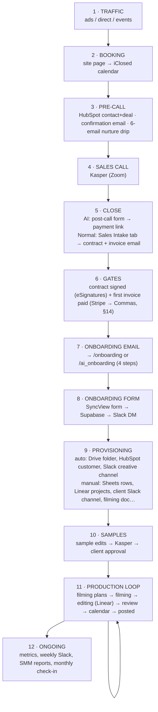
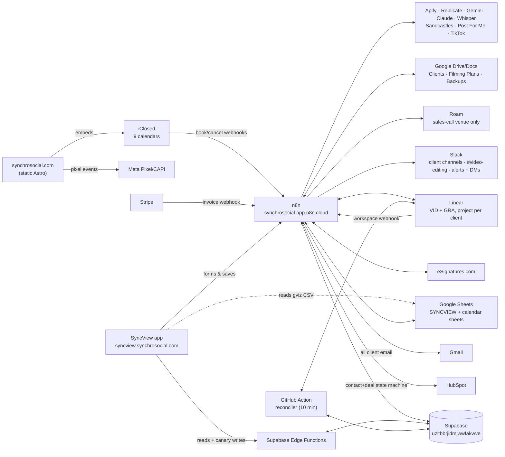

# Synchro Social — Client Lifecycle Map

> **📍 CANONICAL COPY — this file is the source of truth.** The byte-mirror
> was **retired 2026-07-19** after silent drift;
> `synchrosocial/docs/CLIENT_LIFECYCLE_MAP.md` is now a stub pointing here.
> Edit this file only — do not re-create the mirror.
>
> **CUTOVER SAFETY NOTICE (2026-07-14): this copy is stale and non-operative for Track A/Track B.**
> The sections that still describe per-client Track-A canaries, empty Track-B tables, an active n8n
> Linear receiver, ten-minute-only healing, or n8n-primary app writes are historical. Current truth:
> Track A is full-roster; the Track-B mirror is populated; the Production caller is live but
> authority-locked; `linear-inbound` is the real-time EF lane; the legacy combined n8n receiver is
> inactive/unpublished; and the pager participates in reconciler cadence. Do not plan, flip, restore,
> or retire from this file. Use the current `client-analytics` System Map, cutover register, GO LIVE,
> FLIP, and ROLLBACK. *(Updated 2026-08-20: the original retirement condition —
> "until a byte-identical update lands in both repositories" — became
> unsatisfiable when the mirror was retired on 2026-07-19. This notice is
> retired instead when the Track A/Track B sections above are rewritten against
> the current `client-analytics` System Map and cutover register.)*
>
> **The master map.** Every traffic source → page → calendar → automation →
> human step → data store, from a stranger clicking an ad to a live client
> getting weekly content. Mapped **2026-07-10** from the live n8n instance,
> the `synchrosocial` and `client-analytics` repos, Linear, and the design
> docs. **Re-verified against live n8n on 2026-08-20 (99 workflows, 83
> active).** Companion docs:
>
> | Doc | Covers |
> | --- | --- |
> | `synchrosocial` repo — `docs/ECOSYSTEM_MAP.md` | The booking layer in detail — pages ↔ iClosed calendars |
> | `synchrosocial` repo — `docs/meta-ads/README.md` | Tracking: pixel, CAPI, event map, Meta campaign memory |
> | `client-analytics` repo — `NEW_CLIENT_ONBOARDING.md` | The manual per-client setup runbook (step-by-step) |
> | `client-analytics` repo — `TRACK_A_…` / `TRACK_B_…` specs | In-flight migrations (n8n→Edge Functions, Linear replacement) |
>
> ⚠️ **This map has a shelf life.** Linear is being replaced (Track B), Sheets
> are being migrated to Supabase, and the repo is being reorganized. §14 lists
> what's in flight; when one of those lands, update the affected section and
> the date above.

---

## 0. The lifecycle at a glance



Two parallel funnels run through the whole pipeline — **Normal** (main
social-media service, purple) and **AI** (AI-clone service, coral). They are
distinguished by: the iClosed calendar booked (top), the HubSpot contact
property `is_ai_client` (middle), and the `funnel` field / Supabase table
(`client_onboarding` vs `ai_client_onboarding`) at onboarding.

---

## 1. Stage 1 — Traffic & booking (the website)

Detailed page↔calendar mapping lives in `docs/ECOSYSTEM_MAP.md`. Summary:

| Entry | Page path | Calendar (iClosed slug) | Qualifies? | After booking |
| --- | --- | --- | --- | --- |
| Cold ads (current Meta plan) | `/` or `/apply` | `social-media-consultation` | YES | redirect → `/thank-you` |
| Cold ads (AI VSL path, kept) | `/ai` → `/call` | `ai-intro-call` | YES | internal confirm |
| Events hub QR | `/event` → book | `demo` | no | internal |
| AI invite — clients | `/ai-invite/schedule-clients` | `demo` | no | internal |
| AI invite — investors | `/ai-invite/schedule-investors` | `1-1-call-with-kasper` | no | internal |
| Legacy homepage | `/old` | `demo` | no | internal |
| Onboarding step 3 (normal) | `/onboarding_step3` | `kickoff-call` (60 min) | no | internal → step 4 |
| Onboarding step 3 (AI) | `/ai_onboarding_step3` | `ai-clone-consultation` | no | internal → step 4 |
| Monthly check-in email | (email link, no page) | `check-in` | no | — |

All calendars are `https://app.iclosed.io/e/synchrosocial/<slug>`, host
kasper@synchrosocial.com. **Nine calendars exist in practice** — the eight
above plus the floating **iClosed LIFT widget** (id `Pk9Vea_CtsCr`) shown on
`/`, `/apply`, `/thank-you`, whose target calendar is set in the iClosed
dashboard (not in code — worth confirming which calendar it books).
The `check-in` calendar is used only by the *Clients — Monthly Check-in*
automation (§10) and appears on no page and no other map.

**Tracking** (detail in `docs/meta-ads/README.md`): Meta Pixel
`4309835332571875` on every page; `ViewContent` on `/apply` and `/call`;
custom `iclosed_potential/qualified/disqualified` from the embed bridge; and
`Schedule` + `Lead` on `iclosed.call_scheduled` (deduped with `/thank-you`
fallback via a stored event id). ⚠️ Because the bridge lives in
`IClosedEmbed.astro`, **booking the onboarding kickoff calendars also fires
`Schedule`+`Lead`** — post-sale clients trip the acquisition conversion
events (see §15.1).

---

## 2. Stage 2 — Call booked (automation kicks in)

iClosed fires its **"Call booked" webhook** →
`POST synchrosocial.app.n8n.cloud/webhook/iclosed-call-booked` →
n8n **Sales — Call Booked (iClosed)** routes on the event slug:

| Event slug | Route |
| --- | --- |
| `ai-intro-call` | AI branch (inline in the router) |
| `social-media-consultation` | sub-workflow **Normal Sales — Booking Handler** |
| anything else (`demo`, `1-1-call-with-kasper`, `kickoff-call`, …) | **ignored** — no CRM record, no email (§15.12) |

Both branches do the same dance:

1. **HubSpot**: search contact by email. New lead → create contact
   (AI branch also sets `is_ai_client=true`), create **deal** in the default
   pipeline at stage `appointmentscheduled`, save `deal_id` on the contact.
   Returning lead → no new deal, short re-confirmation email only.
2. **Confirmation email** (Gmail, "Synchro Social"): normal =
   "You're booked, {first_name}" (accept-the-invite + 1B-views pitch);
   AI = "You're booked, {first_name}. Here's what happens next."
3. **Pre-call nurture drip** (new leads only) — sub-workflows
   **Normal Sales — Pre-Call Nurture** / **AI Sales — Pre-Call Nurture**:
   wait 1 h, then send **6 emails** spaced evenly across the remaining time
   to the call (interval = time-to-call ÷ 7, minimum 30 min). Before every
   send it checks the n8n Data Table **`iClosed Cancelled Calls`** and stops
   silently if the booking was cancelled.

   | # | Normal funnel subject | AI funnel subject |
   | --- | --- | --- |
   | 1 | The engine behind 1,000,000,000 views | You wake up, {first}, and your content is already done. |
   | 2 | "Do I have to be on camera?" — and 4 more questions everyone asks | Bad AI avatar vs. good AI avatar |
   | 3 | How fast this works — real numbers, no hype | {first}, will your audience know it's AI? 🤔 |
   | 4 | Why most content teams fail personal brands | Why most content teams fail personal brands |
   | 5 | What content production actually costs in 2026 | What content production actually costs in 2026 |
   | 6 | {first}, your first 90 days, step by step | {first}, your first month with us, step by step |

**Same-day bookings behave differently** (changed 2026-08-10 → 08-12 across
`Sales — Call Booked`, `Normal Sales — Booking Handler`, and both nurture
sub-workflows): every branch now tests `diffDays <= 1`. A call booked for
today or tomorrow gets **nurture #1 only and no confirmation email**; a
future-dated booking keeps the confirmation plus the full six-email
schedule. The table above describes the future-dated path.

**Kasper gets one alert per recognised booking** — a **Telegram** message
(`Telegram Kasper Booking Alert` in the router, credential *Telegram —
Booking Alerts*, chat `136443465`, HTML parse mode, added 2026-08-12). Fires
from the `ai-intro-call` and `social-media-consultation` branches. The
companion Roam chat alert (`Read Kasper Roam Identity` →
`Send Kasper Roam Booking Alert`) was removed 2026-08-24 — Sidney's call:
Telegram alone is enough — leaving Telegram as the only booking-alert rail.
⚠️ Nothing in n8n's workflow *metadata* mentions Telegram — a keyword scan
of all workflow names/descriptions returns zero hits, so it is invisible to
anyone rebuilding this map from the API.

**Cancellations**: iClosed "Call cancelled" webhook →
`/webhook/iclosed-call-cancelled` → **AI Sales — Call Cancelled (iClosed)**
writes a row into `iClosed Cancelled Calls`. Despite the "AI" name it's the
kill-switch for **both** funnels' nurtures. It does **not** touch the HubSpot
deal — a cancelled call's deal stays at `appointmentscheduled` (§15.13).

---

## 2b. Stage 2b — Abandoned bookings (recovery lane)

Built **2026-08-14**; three workflows, all active. iClosed's `postMessage`
carries only `{type}`, so an abandoned booking cannot be detected in the
browser — capture has to be server-side.

1. **Sales — Booking Recovery Capture (iClosed)** (`31DnMJLU3YM89py1`) —
   receives iClosed's **"Contact by status"** webhook at
   `POST /webhook/iclosed-lead-abandoned`. This is a **second iClosed
   webhook lane**; §2 documents only `iclosed-call-booked`. It records the
   lead in the n8n Data Table **`booking_recovery`** (26 columns), armed
   once per lead. It also writes two HubSpot custom properties as **JSON
   blobs** — `ad_attribution` (`utm_*`, `fbclid`, referrer, calendar,
   captured_at) and `booking_recovery` — because HubSpot's free tier caps
   custom properties at 10 account-wide (§6 decision).
2. **Sales — Booking Recovery Dispatch** (`nQ4vnZ8bmG3E3Lor`) — sends the
   recovery email, **re-checking HubSpot immediately before every send** so
   anyone who booked in the meantime is never chased. Live launch guards,
   unchanged since launch: `MAX_SENDS_PER_RUN = 5` and
   `ACTIVATED_AFTER = 2026-08-14T23:30Z`. Email only; SMS is parked on
   Twilio/A2P registration. Since 2026-08-19 each send also DMs Sidney on
   Slack. The email carries **no unsubscribe link** (owner decision,
   recorded only in the workflow until now).
3. **Sales — Booking Recovery Heartbeat** (`a2sJJ3oZMefASPl2`) — daily 9am
   Slack DM: captured, sent, still-waiting, plus a loud alarm if nothing was
   captured in 24 h.

Most abandoned bookings are paid-traffic leads, so this is the main
follow-up path for ad spend that does not convert on the first visit — see
`synchrosocial/docs/meta-ads/README.md`.

---

## 3. Stage 3 — The sales call & the close

Kasper takes the call (Zoom, from the iClosed booking). What happens after
differs by funnel — this asymmetry is by design but easy to forget:

**AI funnel — Post-Call Next Steps** (n8n form at
`…/form/post-call-actions`, internal): Kasper enters the client email +
picks Monthly/Quarterly → workflow verifies the contact has
`is_ai_client=true` → sends "Next Steps - Let's Get Started!" email with the
Stripe payment link (monthly `buy.stripe.com/3cI00i31Qa4n…` / quarterly
`buy.stripe.com/dRm4gyfOC7Wf…`) and promises the agreement email → moves the
deal to `presentationscheduled`. **Non-AI clients silently no-op** in this
form.

**Normal funnel — Sales Intake tab** (SyncView, Kasper-gated via
`?Kasper=1`): Kasper fills a 12-field form (client name/email/Instagram,
closed-by, contract start date, deliverables, billing type, amount, payment
link, termination clause, referred-by) → `POST /webhook/sales-intake-submit`
→ n8n **Sales Intake — Submit**:

- Validates hard pricing rules: monthly = **$2,997** with Stripe link
  `buy.stripe.com/00waEW0TI6Sb…`, quarterly = **$7,991** with
  `buy.stripe.com/28E00i6e2ekD…`; custom/one-time must NOT reuse those links.
- Inserts an audit row into Supabase **`sales_intakes`** (status lifecycle
  `submitted → contract_created → email_sent`, plus `preview_*` and failure
  states).
- Creates the **eSignatures.com** "Sales and Service Agreement" from
  template `be936623-…` with the form's placeholder fields.
- Sends ONE combined client email — subject *"{first}, your Synchro Social
  agreement + first invoice"* — with the signing link and the Stripe link.
- Slack-DMs Sidney a confirmation (or a 🚨 alert with manual-recovery links
  on eSign/email failure).
- Supports `preview_contract` (create + return signing URL, no email) and
  `send_existing_contract` (send a previously previewed contract).

> **Current blocker (F106/F107):** “Kasper-gated” describes only the visible per-tab UI unlock.
> The active webhook authenticates no caller. It also acknowledges both send branches before the
> email result, trusts browser-round-tripped preview identifiers/link state, and has no durable
> request idempotency key. Require an active individual Kasper/Admin principal plus a server-owned
> receipt/state machine, or deactivate this route and use the manual process.

`SALES_INTAKE_DESIGN.md` is the reconciled deployed-state contract. F106/F107 and the downstream
F115/F116 gates must all close before this funnel is operationally trusted.

---

## 4. Stage 4 — Contract + payment gates → onboarding email

Two independent provider callbacks set HubSpot contact properties and attempt to trigger the
onboarding email. The intended rule is “exactly once after both verified gates,” but current graphs
do not safely implement it:

| Property | Set by | Meaning |
| --- | --- | --- |
| `is_ai_client` | booking router | funnel routing key for everything downstream |
| `deal_id` | booking router | link to the deal |
| `contract_signed` | Sales — Contract Signed | eSignatures done (idempotency guard) |
| `first_invoice_paid` | Sales — Invoice Paid (Stripe) | first Stripe invoice done (only the first payment matters) |
| `onboarding_sent` | onboarding-email workflows | prevents double-send |

- **Sales — Contract Signed** (`/webhook/contract-signed`): deal → `closedwon`,
  `contract_signed=true`. It compares a static caller-body token, not the provider's native
  raw-body HMAC, and does not correlate the event to the agreement created for this sale. If
  `first_invoice_paid` already true and `onboarding_sent` empty → route by
  `is_ai_client` → send onboarding email.
- **Sales — Invoice Paid (Stripe)** (`/webhook/stripe-invoice`): deal →
  custom stage `3230372548` ("invoice paid"), `first_invoice_paid=true`. The unauthenticated route
  does not verify the provider signature/raw body, event identity/type/mode/account/paid state, or
  correlate the payment to server-owned sale state. Mirror-image gate check → onboarding email.
- Missing HubSpot contact on either webhook → ⚠️ Slack DM to Sidney to
  handle manually.

> **Current blockers (F115/F116):** both routes acknowledge on receipt and trust unverified caller
> events. Each then decides from the contact snapshot read **before** its own flag write. A
> simultaneous valid pair can leave both flags true while neither sends; duplicates can make more
> than one asynchronous child pass the old `onboarding_sent` check. The children have no durable
> unique gate job, joined completion receipt, error workflow, or reconciler. Provider-native
> verification/correlation plus one atomic idempotent gate and resumable email job are mandatory.

**Onboarding email** (Normal Client / AI Client — Send Onboarding Email):
subject *"Synchro Social X {first_name} — doesn't that sound magnetic?"*,
CTA → `synchrosocial.com/onboarding` (normal) or
`synchrosocial.com/ai_onboarding` (AI). Sets `onboarding_sent=true` and
moves the deal to… stage value **`closedlost`**, repurposed to mean
"onboarding sent". The id is misleading but the stage type is open, so
HubSpot does not count it as lost — §15.17.

**HubSpot deal-stage lifecycle as actually used** (board labels in quotes):
`appointmentscheduled` "Call Scheduled" → (`presentationscheduled` "Next
Steps Sent", AI only) → `closedwon` "Contract Signed" / `3230372548`
"Invoice Paid" → `closedlost` "Onboard Email" (⚠ misleading *id*, but the
stage type is open so nothing is counted as lost — §15.17) →
`decisionmakerboughtin` **"Form Completed"** →
`3230452433` **"Closed Won"** (the real end state — the active client
roster). A separate `3230452434` "Closed Lost" exists and is unused by
automation.

Since **2026-08-20** provisioning (§6) writes the last two hops back to
back, so nothing rests in "Form Completed"; it survives only as a
`hs_v2_date_entered_decisionmakerboughtin` timestamp for reporting. Before
that date **nothing in any workflow ever set `3230452433`** — the 26 deals
sitting there were bulk-imported by hand on 2026-08-18.

---

## 5. Stage 5 — Client-side onboarding (site + form + kickoff call)

**Website steps** (static pages, this repo; shared shell
`OnboardingStep.astro`; no data collected on-site):

| Step | Normal (`/onboarding…`, purple) | AI (`/ai_onboarding…`, coral) |
| --- | --- | --- |
| 1 — What To Expect | Wistia video | same video |
| 2 — Complete This Form | button → `syncview.synchrosocial.com/?onboarding=1` | button → `…/?onboarding=ai` |
| 3 — Strategy Session | embeds `kickoff-call` (60 min) | embeds `ai-clone-consultation` |
| 4 — Final Words | wrap-up video, end | wrap-up video, end |

**The onboarding form** lives in SyncView (`client-analytics` repo,
`ONBOARDING_FORM.md`) at clean paths `/onboarding_form` /
`/ai_onboarding_form`. Chrome-free, no staff password, autosaves drafts to
localStorage. Sections: basic info → brand & audience → style
(video/thumbnail prefs) → **sample video** (normal funnel only — the ~30 s
clip that seeds the samples stage) → photos & source material → goals →
account access (credentials). AI variant swaps sample-video for an
**AI avatar** section (personality, setting, framing, voice, likeness).

**Submit pipeline** (never-lose-a-submission design, `ONBOARDING_FALLBACK.md`):

```
form ──POST──▶ n8n /webhook/onboarding-submit        (normal)
              n8n /webhook/ai-onboarding-submit      (AI)
                │  insert → Supabase client_onboarding / ai_client_onboarding
                │  (insert failure → dead-letter Data Table + 🚨 DM)
                ├─ Slack DM Sidney ("🎉 / 🤖 new onboarding submitted")
                ├─ best-effort POST → Supabase EF client-credentials
                │    (action onboarding_import — seeds the credentials vault)
                └─ Execute Workflow ──▶ Client — Onboarding Provisioning (§6)
   on failure ─▶ Supabase EF onboarding-capture  AND
                n8n /webhook/onboarding-fallback → Data Table onboarding_fallback → 🛟 DM
```

**Current acknowledgement boundary (F110):** the primary graphs respond after the intake-row
insert/fail-soft alert, then start provisioning without waiting; credential import is a separate
fail-soft branch. A duplicate row responds directly and runs neither. The form clears its draft/id
and says Thank You on any 2xx, including capture-only fallback. Therefore this diagram shows
attempted side effects, not a transaction: **captured ≠ provisioned** until a durable resumable job
reads every step back as complete. The canonical staff handoff is the SyncView inbox/job, not the
replaced Notion trigger (F111).

A third, read-only funnel exists: **`legacy_onboarding`** — 21 old Notion
form submissions imported into Supabase, credentials split into a
service-role-only column. Staff read all three funnels via Edge Functions
(`onboarding-list`, `ai-onboarding-list`, `legacy-onboarding-list`,
credential-stripped; `onboarding-full` = Kasper-only, keyed, un-stripped).

---

## 6. Stage 6a — Automated provisioning

n8n **Client — Onboarding Provisioning** (called by both submit workflows
with `funnel = standard | ai`):

This dispatch is currently unawaited and has no durable job/step ledger, completion callback, or
whole-run reconciliation. Worse, the public submit path can launch it from caller-supplied identity/
email without invitation, verified-sale correlation, authenticated staff approval or provider
sandbox (F128). Each item below is an intended real-provider side effect, not a completion guarantee.
Do not run a fictional submission as TEST: there is no complete captured inverse or teardown.

1. **Google Drive**: create folder `{first}-{last}` inside the shared
   **Clients** folder (`17u2c8JMLkrKMRxAXczirMFitNv1wD-JA`). ⚠️ This node has
   no error handling and gates everything after it — a Drive failure kills
   the HubSpot update *and* the Slack enqueue (§15.20).
2. **Find the contact — email first, then phone** (rebuilt 2026-08-20).
   `Find Contact` searches HubSpot by the **form** email. If that misses,
   `Find Contact by Phone` searches
   **`hs_searchable_calculated_phone_number`** — HubSpot's digits-only
   normalised copy — on the last 10 digits. An exact match on `phone` does
   *not* work: the CRM stores e.g. `+15551234567` while the form supplies
   `5551234567`. `Resolve Contact` picks email-match first, else
   phone-match, and emits one item carrying `found`, `matched_by`,
   `contact_id`, `crm_email`, `deal_id`.
   *Why:* clients routinely fill the onboarding form with a different email
   than the one on their CRM record — e.g. a personal `@yahoo.com` address on
   the form against the `@gmail.com` one the CRM holds. This has happened on a
   real onboarding **and** on a real Commas payment; it used to strand them
   silently. (Deliberately no names or addresses here — this repository is
   public.)
3. **HubSpot**: contact lifecycle → `customer`; deal →
   `decisionmakerboughtin` ("Form Completed") → **`3230452433` ("Closed
   Won")** back to back (§4). The lifecycle upsert now keys on the
   **CRM's** email, never the form's, so a mismatch can no longer create a
   phantom contact — the old behaviour minted a duplicate contact on every
   mismatch.
4. **Slack** (rebuilt 2026-08-24, reversing the 2026-07-28→2026-08-24 Roam
   detour — decision log in §14): builds an immutable kickoff + form-answer
   brief, fingerprints it (FNV-1a hash + length), and inserts one row into
   the n8n Data Table **`Slack Creative Channel Queue`**
   (`SLpem4MfCeVoli4G`). A 3-way Switch routes `enqueue` / `duplicate` /
   `manual reconciliation`; **Client — Slack Creative Channel Finalizer**
   (`udkwwzdFuPW3K2CE`) creates the actual `{client}-creative` public Slack
   channel — same `#{first-last}-creative` naming the pre-Roam automation
   used, confirmed against the real channels already in the workspace.
   Slack-post failures still fall back to a Slack DM (`DM Brief Fallback` →
   Sidney) — same rail, now the fallback path instead of the whole thing.
   **P0 correction (F129) still stands — now by deliberate choice, not
   drift.** The brief renders account-access answers, Instagram
   backup/recovery codes and the LastPass line **inlined directly into the
   kickoff (first) message**, not just the follow-up brief — owner decision
   2026-08-24, credentials should be visible without a click and the
   security tradeoff is accepted. That string is persisted in a Data Table
   row (`form_brief`) **and** posted into the Slack channel.

**Failure visibility** (added 2026-08-20): both IF nodes now have their
false branch wired to a Slack DM — `Contact Found?` → *"no matching HubSpot
contact"* (quotes the form email and phone), and `Has Deal?` → *"contact
found, but no deal linked"*. Previously both false branches went nowhere, so
the run reported **success** while doing nothing. ⚠️ The workflow itself
still has **no `errorWorkflow`** (§15.20).

---

## 7. Stage 6b — Manual setup (where a new client must exist)

The runbook is `client-analytics/NEW_CLIENT_ONBOARDING.md`. This table is
the checklist of **every place a client exists**, and whether creation is
automated today:

| # | System | What gets created | How |
| --- | --- | --- | --- |
| 1 | HubSpot | contact + deal + lifecycle | ✅ auto (booking → gates → provisioning) |
| 2 | Supabase `client_onboarding` / `ai_client_onboarding` | form submission | ✅ auto (form submit) |
| 3 | Supabase `client_credentials` | login vault rows (`needs_review`) | ⚠️ fail-soft caller-derived owner; no canonical roster readback or joined receipt/resume (F69/F110) |
| 4 | Google Drive "Clients" folder | client folder | ⚠️ unawaited provisioning attempt; no completion receipt (F110) |
| 5 | **Slack creative channel** `{client}-creative` (Roam 2026-07-28→08-24, back to Slack 2026-08-24) | internal creative space + brief, credentials inlined in the first message | 🚨 public-triggered unawaited provisioning; the brief includes raw account-access answers by owner decision and is **persisted** in the `Slack Creative Channel Queue` Data Table as well as posted to Slack (F128/F129, §6) |
| 6 | Slack **client channel** | the channel the client is in (weekly reports, tweak pings) | ❌ manual — note the ID `C…` |
| 7 | SYNCVIEW sheet → `Clients Info` | the **public, non-secret** row that puts the client live in SyncView (allowlist is sheet-driven): name, handles, competitors, keywords, `slack_channel_id`, `postforme_account_id` | ❌ manual |
| 7a | Supabase `client_access` + authenticated link builder | service-role-only review token and the staff-authorized path that copies one exact client's link; **never put the token in Clients Info** (audit F33) | ❌ Track-B onboarding/distribution gap |
| 8 | SYNCVIEW sheet → `Social Media Managers` | client → SMM assignment (+ per-SMM Linear key, Slack id) | ❌ manual |
| 9 | SYNCVIEW sheet → `Monthly Checkup` | opt-in row for monthly check-in emails | ❌ manual |
| 10 | Linear | **one project per client**, named exactly the client name, on Video (VID) + Graphics (GRA) teams (duplicate "Client Example"), SMM as lead, Slack channel linked, brand info in description | ❌ manual (→ replaced by Track B) |
| 11 | Google Drive "Client Filming Plans" | client folder + **master filming Doc** (one Docs tab per month) | ❌ manual (Kasper) |
| 12 | Supabase `filming_plans` | row linking the master Doc | ❌ manual (via Filming Plans tab, staff-key gated) |
| 13 | Content-calendar sheet (`1XOyGrvSo52e…`) | per-client tab (used by add-to-calendar automation) | ❌ manual |
| 14 | Sandcastles | client + competitor handles on the watchlist | ❌ manual |
| 15 | Post For Me | TikTok account (`spc_…`) for auto-upload | ❌ manual, optional |
| 16 | `SAMPLES_BY_CLIENT` map in **VIDEO PRODUCTION AUTOMATION** code node | reference thumbnails for the AI thumbnail pipeline | ❌ manual **code edit** (§15.7) |
| 17 | Supabase `calendar_posts` / `sample_reviews` | rows auto-create on first write (PK `(client, id)` by slug) | ✅ auto |

Once the `Clients Info` row exists the client appears in SyncView with no
deploy, and the scheduled robots (§10) pick them up automatically. Client
slug convention everywhere: lowercase, strip accents and leading "Dr.",
drop non-alphanumerics.

---

## 8. Stage 7 — Samples

The onboarding form's sample video (plus brand answers) seeds **sample
edits** — subtitle styles, thumbnail looks — approved before real content
starts. ⚠️ Two generations coexist (`client-analytics` docs, `SAMPLES_*`):

- **Content Samples** (gen 1, `content_samples` table): the staff nav/route is retired and the old
  client URL currently redirects unsafely into generic Sample Review (F117). The dormant strip had
  one status/thread and `?sv2` default-on reads; its active n8n writers fan out Sheet + Supabase but
  can continue after a Sheet failure, so `?sv2=0`/automatic Sheet fallback is not writable recovery
  (F57). Do not restore this generation without one exact-client and coupled-authority boundary.
- **Sample Review** (gen 2, `sample_reviews` + `sample_review_events`,
  **GA default ON** since 2026-07-02 with sticky `?sxr=0` opt-out): the calendar's
  architectural twin. Components video + thumbnail; statuses In Progress →
  For SMM Approval → Kasper Approval → Client Approval → Approved (+ Tweaks
  Needed interrupt); per-component comment threads; Linear VID/GRA
  sub-issue links; Kasper cross-client review sub-tab; client review portal
  via token link `?sxr=1&c=<name>&v=sample-reviews&t=<token>`; writes via
  EF `sample-review-upsert` (canary per client) or n8n fallback; audit
  ledger + 10-min Linear reconciler.

Client approves samples → approved look is recorded (Linear project
description holds "approved sample" links today) → production begins.

---

## 9. Stage 8 — The production loop

The recurring engine once a client is live:

1. **Filming plans** — Kasper writes one master Google Doc per client, one
   tab per month. Supabase `filming_plans` is the source of truth; the
   SyncView Filming Plans tab combines it with calendar runway
   (days of scheduled posts left) into 🟢/🟡/🔴 "who's running out of
   content" alerts (red ≤ 10 d). Doc tabs are read via n8n
   `filming-plan-tabs` (Google Docs API).
2. **Filming** — client films (or AI clone generates); footage lands in the
   client's Drive folder.
3. **Editing intake — VIDEO PRODUCTION AUTOMATION** (n8n, 6 webhooks): the
   `video-form` creates a Linear parent + one VID sub-issue per video and
   **auto-assigns the editor with the fewest open sub-issues**, then DMs the
   SMM. The `graphic-form` does the same for GRA and runs the **AI thumbnail
   pipeline** (filming-Doc titles via Claude → frame extraction via
   Replicate → best-frame pick via Gemini → composed thumbnail via Gemini →
   Drive upload → Linear comment).
4. **Review lifecycle** — editors/designers move Linear sub-issue states;
   two-way sync keeps SyncView cards in step (see below). SMM → Kasper →
   client approvals happen on the SyncView **content calendar** card
   (per-component statuses: video / graphic / caption / title). Kasper's
   "finish reviewing" state is global/cross-device. Clients review via
   token links; client tweaks land as comments. **Urgent tweaks** ping the
   assigned editor in Slack `#video-editing`. YouTube titles get their own
   review loop (title_status, no Linear). Thumbnail revisions are
   snapshotted for before/after evidence when tweaks are requested.
   **Native-cutover blockers:** the parked Create Post caller can split the canonical card/
   deliverable title and strand post-commit card materialization in one actor's browser
   (F133/F134). Current Production lets a creative choose next status without current-state or
   assignee authorization (F136), collapses filming plan/raw footage/delivery/deliverable links into
   one “Delivered file” URL (F137), and writes activity events that the UI never loads (F138).
   Calendar/Samples reorder is also mouse-drag-only (F135). None may be represented as a complete
   replacement for the SMM/editor day until the corresponding TEST/device matrices pass.
5. **Scheduling & posting** — approved cards get scheduled/posted on the
   calendar. The retained `add-to-calendar` branch is **not a safe ingestion contract** (F126): it
   accepts first-page-only children/comments as complete, can omit later work/links, writes the
   legacy client-facing Sheet, and acknowledges without completeness. Identify and retire its
   caller or rebuild it as a fully paged durable job. TikTok can auto-post via Post
   For Me or the first-party TikTok pilot. **Content-ready notify** emails
   the client ("Your content is ready for review! 🎉").

**Linear ⇄ SyncView sync** (until Track B lands): current real-time inbound is the
`linear-inbound` Edge Function; the combined n8n receiver with Calendar/Samples/Workload branches is
inactive/unpublished and must not be represented as serving production (F46). SyncView → Linear
uses legacy mutation routes until reroute; GitHub reconcilers heal Calendar/Samples drift, while
`workload_issues` remains a derived Linear cache. F29/F126 mean a green reader run is not a
completeness receipt.

---

## 10. Ongoing per-client automations (the robots)

| Automation (n8n) | Schedule | What it does |
| --- | --- | --- |
| CLIENTS METRICS | daily | IG (Apify) + TikTok (Apify) + YouTube stats per `Clients Info` row → appends `Metrics` / updates `PostTracking`. **F124:** source/prior-state failures can become ordinary zero/reset rows or stop later roster clients. One retained run failed on its first Metrics append after PostTracking work and skipped the other 25 clients; require per-client/platform coverage, roster isolation and last-good/degraded semantics. |
| TOP VIDEOS / COMPETITOR RESEARCH / MARKET RESEARCH | scheduled | research briefs per client → sheets → SyncView Analytics tab. **F124:** Top Videos can treat provider errors as empty/old complete truth; in each of four green runs, 4–7 of 15 configured YouTube lanes used the same no-source branch as missing/empty input while all 29 client results were written. |
| Weekly Slack – Top Reel | Mondays | **disabled 2026-09-03** (owner request) — was posting each client's top reel into their client Slack channel; workflow `BTxic5NSaCMtZMh6` unpublished in n8n, definition intact for re-enabling |
| Clients — Monthly Check-in | 1st of month, 08:00 | emails every `Monthly Checkup` row a check-in with the iClosed **`check-in`** calendar link |
| SMM Reports — Weekly Reminder | Mondays 09:00 | emails Kasper the SMM weekly-reports viewer link |
| SMM Reports — Manager Sync | daily 06:00 | syncs `Social Media Managers` sheet → Supabase `social_media_managers` |
| Workload — Reconcile | every 10 min | rebuilds `workload_issues` from Linear |
| Calendar — Linear Reconcile Trigger | every 10 min | dispatches the GitHub Action reconciler |
| SyncView — Weekly Backup | Sundays 02:00 | dated Drive folder: Sheet copy, repo zip, workflow export, Supabase dumps. **F13:** continued errors/empty substitution mean a green run is not a complete restore set; D-1 independent manifest/readback/restore remains open. |
| Editors — Labor Week | on demand | per-editor delivery counts from Linear history |
| Error alert relays | event-driven | n8n errors + Supabase EF alerts → DM Sidney |

---

## 11. Systems & data stores (what lives where)

**Supabase** (project `uzltbbrjidmjwwfakwve`) — full table list in the
`client-analytics` migrations; by lifecycle area:

- Sales/onboarding: `sales_intakes`, `client_onboarding`,
  `ai_client_onboarding`, `legacy_onboarding`, `onboarding_fallback`
  (all RLS-locked, no anon reads).
- Credentials vault: `client_credentials` + `client_credential_events` +
  `client_credentials_rev` (EF-only, keyed, audited incl. reveals).
- Production: `calendar_posts` (+`calendar_post_events`), `content_samples`,
  `sample_reviews` (+`sample_review_events`), `filming_plans`,
  `workload_issues`, `thumbnail_media_revisions`, `smm_weekly_reports`,
  `templates`, `caption_prompts`, TikTok tables.
- Track B (mostly empty, awaiting go): `clients`, `team_members`,
  `batches`, `deliverables`, `deliverable_events`, `mirror_outbox`,
  `linear_archive`, `syncview_runtime_flags`.

**Google Sheets** (legacy layer, being migrated):

- **SYNCVIEW** (`10QQnWOQY73…`): `Clients Info` (⚠ still the live client
  allowlist), `Social Media Managers`, `Monthly Checkup`, `Video Editors`,
  `Metrics`, `TopVideos`, briefs tabs, `Linear Submissions`, `PostTracking`.
- **SyncView Calendar** (`1Gsn5xLImJy…`): legacy `Calendar_<slug>` /
  `Samples_<slug>` mirrors (no longer load-bearing).
- **Client-facing content calendar** (`1XOyGrvSo52e…`): one tab per client,
  written by `add-to-calendar`.
- **Project Central** (`1ZAGZBMoT1M…`): internal ops tracker. Its active unauthenticated API can
  accept partial/empty/stale state, clear all three live tabs before append, and leave an empty or
  partial hierarchy with no staging/revision/restore receipt (F123). Do not use it as a recovery tool.

**n8n Data Tables** (2026-08-24): `iClosed Cancelled Calls`
(nurture kill-switch), `onboarding_fallback` (drafts / fallback /
dead-letter), **`booking_recovery`** (`xEhLpKwNv8uTaeAK`, 26 cols — §2b),
**`Slack Creative Channel Queue`** (`SLpem4MfCeVoli4G`, 18 cols — §6),
`caption_jobs` (`kdtB3eRpXNBZpbdG`), `linear_intake_receipts`
(`EncletbVvvYfSDfF`). `Roam Creative Group Queue` (`vzD1Env0rhe7cxLf`) and
`Roam Identity Map` (`LVtWFuS7Zr4JikUi`) are retired in place (data kept,
no longer written) now that the Roam finalizer is archived — the Slack
roster instead reads the Social Media Managers tab's `slack_profile_url`
column directly, plus three hardcoded ids (owner/Kasper/Rocío) in code.

**HubSpot**: contacts + deals, default pipeline; custom contact properties
`is_ai_client`, `deal_id`, `contract_signed`, `first_invoice_paid`,
`onboarding_sent` (§4). This is the sales-funnel state machine — nothing
else in the pipeline reads HubSpot.

**Linear** (workspace `synchro-social`, until Track B): teams **VID** +
**GRA** (+ Reporting, Podcast Episodes, Content Research, Executive
Assistant); one project per client named exactly the client name (the
universal join key); per-post VID/GRA sub-issues; states relied on by name:
Todo/In Progress/For SMM Approval/Kasper Approval/Client Approval/Approved/
Tweak(s) Needed/Scheduled/Posted.

**Slack**: per-client client channel (`slack_channel_id`, weekly reports +
tweak pings), per-client `#name-creative` internal channel (`§6`,
`creative_channel_id` — **recreated automatically again as of 2026-08-24**;
do not confuse the two, they are different channels for different
audiences), `#video-editing` (urgent tweaks), DMs to Sidney
(`U0ACW93FS30`) as "SyncView Bot" for everything operational.

**Roam** (`api.ro.am`, credential *Roam API*): the sales-call venue only
(`join_url` defaults to a ro.am room). No longer used for Kasper's booking
alerts (Telegram-only since 2026-08-24) or per-client creative-group
provisioning (Slack since 2026-08-24, §6) — both moved off Roam the same
day.

**Telegram**: `Telegram — Booking Alerts` bot → Kasper's chat `136443465`,
new-booking alerts only (§2).

**External services**: iClosed (booking + webhooks), eSignatures.com
(contracts), Stripe (payment links + invoice webhook — **being replaced by
Commas/FanBasis, §14**), Roam, Telegram, Gmail (all client
email, sender name "Synchro Social", **all sent from
hello@synchrosocial.com** — every email workflow consolidated onto the one
"Hello email" n8n credential on 2026-07-17; the old "House gmail"
(house@synchrosocial.com) credential is now used only by inactive/legacy
workflows),
Google Drive/Docs, Sandcastles (content research), Post For Me +
TikTok API (auto-posting), Wistia/YouTube (site videos), Meta Pixel/CAPI,
Apify + Replicate + Gemini + Anthropic + OpenAI Whisper (metrics + AI
thumbnail/caption pipelines), Notion (legacy forms only).

---

## 12. n8n workflow inventory (all 99, grouped)

Live instance `synchrosocial.app.n8n.cloud`, snapshot **2026-08-20**
(99 total, 83 active, 16 inactive). ★ = described in detail above.
(i) = inactive. Seven workflows were added since the 2026-07-10 snapshot
and none were deleted, so per-group subtotals below have been bumped.

**Sales & nurture:** ★Sales — Call Booked (iClosed) · ★Normal Sales —
Booking Handler · ★Normal Sales — Pre-Call Nurture · ★AI Sales — Pre-Call
Nurture · ★AI Sales — Post-Call Next Steps · ★AI Sales — Call Cancelled
(iClosed) · ★Sales Intake — Submit · ★Sales — Contract Signed · ★Sales —
Invoice Paid (Stripe) · ★Sales — Booking Recovery Capture (iClosed) ·
★Sales — Booking Recovery Dispatch · ★Sales — Booking Recovery Heartbeat
(§2b, all added 2026-08-14).

**Onboarding:** ★Normal Client — Send Onboarding Email · ★AI Client — Send
Onboarding Email · ★SyncView Onboarding — Submit · ★SyncView AI Onboarding —
Submit · ★SyncView Onboarding — Fallback Capture · ★Client — Onboarding
Provisioning · SyncView Onboarding — List · SyncView AI Onboarding — List ·
SyncView Onboarding — Legacy List (reads superseded by Edge Functions) ·
★New Client → Slack DM (Notion Onboarding) *(replaced legacy object: active-labelled, but current
sanitized metadata reports no production trigger and no retained executions — F111/§15.10)*.

**Production core:** ★VIDEO PRODUCTION AUTOMATION (6 webhooks: video-form,
graphic-form, linear-projects, linear-issues, add-to-calendar,
log-linear-submission) · ★Filming Plan Tabs · ★Clients — Content Ready
Notify · SyncView Calendar — Get / Upsert Post / Append Post / Delete Post /
Reorder / Reorder (batch) / Generate Caption · SyncView Caption Jobs —
Status / Update · SyncView Caption Prompts — Get / Save · SyncView
Templates — Get / Save · SyncView Kasper — Queue (batch) · Calendar Comment
Merge (helper).

**Linear sync:** ★SyncView Calendar - Linear Status Sync (+ embedded
samples branch) · ★… Linear Set Status · ★… Linear Reconcile Trigger ·
… Linear Add Comment · … Linear Sub-Issues · … Linear Issue Statuses ·
(i) SyncView Samples — Linear Status Sync (standalone fallback) ·
(i) SyncView Samples — Linear Reconcile Trigger.

**Samples:** ★SyncView Samples — Upsert (gen 1) · SyncView Samples — Get /
Reorder · ★Sample Review — Upsert (gen 2) · Sample Review — Get / Reorder ·
(i) SyncView Samples — Provision Missing Tabs · (i) SyncView Calendar —
Provision Missing Tabs.

**Workload & team:** ★SyncView Workload — Reconcile · SyncView Workload —
Tweak Comments · ★SyncView — Urgent Tweak → Slack · ★SyncView Editors —
Labor Week.

**Reports & analytics:** ★SyncView SMM Reports - Weekly Reminder ·
★… Manager Sync · ★CLIENTS METRICS · TOP VIDEOS · COMPETITOR RESEARCH ·
MARKET RESEARCH · Weekly Slack – Top Reel of the Week · Weekly Slack – Top
Reel + Top Videos in Niche (TEST) · ★Clients — Monthly Check-in ·
(i) ONE-SHOT — Scrape Terrin IG.

**TikTok:** SyncView TikTok Upload — Submit / Result / List / Cancel /
Status (Post For Me path) · SyncView TikTok Pilot — Auth Init / Auth
Callback / Token Refresh / Status Cron / Submit / List / Creator Info /
Accounts List (first-party Direct Post pilot) · (i) Register PFM Result
Webhook (run once).

**Ops & monitoring:** ★SyncView - Weekly Backup · SyncView Monitoring Pager
+ Reconciler V2 Trigger *(not MCP-readable — §15.8)* · SyncView Edge Alert
Relay → DM Sidney · SyncView — Error Alerts → DM Sidney · ★Project
Central — Sheet API · (i) Project Central — Inspect (debug) · (i) Project
Central — 3-Tab Migration (one-off) · (i) SyncView Calendar — Supabase
Backfill ×2 (one-offs) · (i) BACKUPS (old) · (i) AI WORKFLOW (old
content-ready flow).

---

## 13. Cross-system relationship map



Reading the map: the **website is inert** (static; only iClosed embeds and
the pixel) — everything stateful happens in n8n + Supabase. **n8n is the
integration hub** for both sales and production. **HubSpot holds sales
state; Supabase holds ops state; Sheets hold the client roster + analytics
(for now); Linear holds production tasks (for now).**

---

## 14. In-flight migrations (what will invalidate parts of this map)

| Migration | Status (2026-07-10) | What changes here when it lands |
| --- | --- | --- |
| **Track A — n8n → Supabase Edge Functions** (interactive writes) | A1/A2/A4 merged; current Calendar/SXR/settings allowlists carry the full active roster; unauthenticated fallbacks remain F67 | §9 write paths; n8n calendar/sample writers are fallback-only |
| **Track B — replace Linear** with in-app `batches`/`deliverables` | mirror tables populated; Production has authority-gated writes but both real teams remain Linear-authoritative; #813 is not merge-safe (F02) | §7 row 10, §9 sync, §11 Linear, Workload source |
| **Off Google Sheets** | calendar/samples/templates/filming-plans done; **client roster (`Clients Info`) + analytics still on Sheets** | §7 rows 7–9, §10 metrics, §11 Sheets section |
| **Off Notion** | product path replaced; operator docs corrected in this audit | F60-safe archive of the active-labelled/no-production-trigger legacy object after zero-use proof (§15.10/F111) |
| **Slack → ro.am** | **REVERTED** (2026-07-28 → 2026-08-24): Kasper alerts and per-client creative-group provisioning moved to Roam, then moved back to Slack 2026-08-24 (owner call — see §15.9). Roam now sales-call venue only | §6, §11 — already updated |
| **Stripe → Commas** (payment processor) | **IN FLIGHT, no receiver yet.** Commas (commas.com, FanBasis API) is taking payments; zero n8n workflows reference it and `Sales — Invoice Paid (Stripe)` is still `/webhook/stripe-invoice` end to end | §4 gates, §11 external services, §13 — see §15.21 for the blocker |
| **Repo reorganization** | in progress in other sessions | file paths cited here |

Also planned per the user: moving the Google-Sheets client roster and the
Linear provisioning steps into the new system — i.e. rows 7–10 of the §7
table are all slated to become automated/Supabase-native.

---

## 15. Drift, gaps & risks (mapped 2026-07-10, re-audited 2026-08-20)

1. **Pixel overcount**: `Schedule`+`Lead` fire from *any* iClosed embed —
   including the onboarding kickoff calendars. Post-sale clients look like
   acquisition conversions to Meta. Fix: gate the bridge by calendar slug.
2. **HubSpot deal stage `closedlost` is repurposed** as "onboarding sent".
   ⚠️ This entry previously said HubSpot reporting "will misread it" — that is
   **retracted**; the stage type is open, so HubSpot counts it correctly. What
   remains is that the *id* is misleading to anything matching the string.
   See §15.17.
3. **Stale docs**: `SALES_INTAKE_DESIGN.md` says the `sales-intake-submit`
   workflow is pending; it's live (2026-07-09). The meta-ads README also
   contains an already-resolved "router gap" warning in its historical
   sections.
4. **LIFT widget** (`Pk9Vea_CtsCr` on `/`, `/apply`, `/thank-you`) is on no
   map; its target calendar is only visible in the iClosed dashboard.
5. **`check-in` calendar** was undocumented before this map (used by the
   monthly check-in email).
6. **Plaintext secrets in n8n code nodes**: a Linear API key, an Anthropic
   API key, and an Apify token are hardcoded inside several workflows
   (VIDEO PRODUCTION AUTOMATION, Status Sync, Set Status, Sub-Issues,
   Editors Labor Week). Move to n8n credentials. (The meta-ads README also
   flags a CAPI token to regenerate.)
7. **Hardcoded `SAMPLES_BY_CLIENT` map**: the AI thumbnail pipeline only
   knows reference thumbnails for clients listed in a code node
   ("Danielle Robin", "Chelsey Scaffidi", "Morgan Burch") — new clients
   need a code edit nobody will remember.
8. **Fragile sync plumbing**: the samples inbound Linear sync is an embedded
   third branch inside the *calendar* status-sync workflow (deleting it
   silently breaks samples). *(Corrected 2026-08-20: the Monitoring Pager
   `qllIDZPkdNAPRj0b` is now MCP-readable. The workflows still invisible to
   sessions are `SyncView Edge Alert Relay → DM Sidney` and `BACKUPS`.)*
9. ~~**Two Slack channels per client**~~ — **flagged 2026-07-28, then made
   moot 2026-08-24.** Provisioning briefly stopped creating `#name-creative`
   (moved to a Roam group, §6) between 2026-07-28 and 2026-08-24. As of
   2026-08-24 it's back to two genuinely different Slack channels by owner
   design, not drift: `#name-creative` (internal, auto-created, §6) and the
   client-facing channel (`slack_channel_id`, still created by hand, §7).
   They serve different audiences — don't collapse them into one column or
   one channel.
10. **Legacy Notion trigger is misleadingly active-labelled** (F111): current sanitized metadata
    reports no production trigger/manual-only execution, its description says setup is incomplete,
    and retained execution metadata is empty. Do not describe it as polling or healthy; the old form
    is replaced. Archive only after F60 backup/restore and identifier-free zero-use proof.
11. **Samples retirement is incomplete** (F57/F117): Sample Review is GA default-on and staff old
    routes are retired, but the old client redirect loses exact-client binding and dormant
    `content_samples` routes/state/backends remain. `?sv2=0` is not writable recovery. Fail the old
    URL closed, inventory stale callers/store parity, then execute owner-approved Phase 2.
12. **Event/investor bookings (`demo`, `1-1-call-with-kasper`) create no CRM
    record** — the router ignores them by design; those leads live only in
    Kasper's calendar.
13. **Call cancellation doesn't update HubSpot** — cancelled calls leave the
    deal at `appointmentscheduled` forever.
14. **CRM → Meta feedback loop** (qualified/closed-won values back to ads)
    is documented but not built (meta-ads README §9.3-9.4).
15. **`closedwon` ≠ actually won**: the deal hits the stage *whose id is*
    `closedwon` at contract signature, before first payment. HubSpot itself
    reports this correctly — the stage type is open (§15.17) — so the hazard
    is only for consumers matching the id string rather than reading
    `hs_is_closed_won`.
16. **Gmail sending is a single-credential dependency** (2026-07-17): every
    client email sends through the one **"Hello email"** n8n credential
    (hello@synchrosocial.com). Google revokes an OAuth credential's token
    whenever that account's password changes — this is exactly what took the
    sales emails down for ~2 days in July (the house@ password was changed
    while the nurture/booking/onboarding emails were still on the "House
    gmail" credential; sends failed silently with *"credential needs to be
    reconnected"*). **Fix in place:** all email workflows now (a) send from
    the Hello credential and (b) have their **Error Workflow** set to
    *SyncView — Error Alerts → DM Sidney*, so any future send failure DMs
    Sidney on Slack within seconds instead of failing silently. If the Hello
    password is ever changed, reconnect the "Hello email" credential in n8n
    (Credentials → Hello email → Reconnect).
    ⚠️ **Planned regression:** the booking-recovery emails (§2b) are due to
    move to Kasper's own mailbox. That re-splits the credential surface, so
    his credential must carry the same **Error Workflow** or a password
    change on his side kills recovery emails silently — the exact failure
    this consolidation was created to end.

**Found 2026-08-20 (second audit pass):**

17. **The silent dead-branch pattern** — the most load-bearing defect in the
    stack. An IF node whose false branch is wired to nothing ends the run
    with no log, no alert, and an execution n8n paints **green**. Four
    instances stranded real clients in one day: `Has Deal?` and
    `Contact Found?` in provisioning (**fixed 2026-08-20**), and
    `First Invoice?` + `Contract Signed Too?` in `Sales — Invoice Paid
    (Stripe)` (**still open** — an invoice paid before the contract is
    signed does nothing and tells nobody). `Not Yet Marked Signed?` /
    `Invoice Paid Too?` in `Sales — Contract Signed` are the same shape.
    Also `Has Customer Email` is a **Filter**, so an invoice with no
    `customer_email` is dropped before the "contact not found" alert can
    fire. Treat an unwired false branch as a bug on sight.
18. **The gates only ever evaluate at webhook time.** `Sales — Contract
    Signed` and `Sales — Invoice Paid` each check the *other* flag when
    their own webhook lands, and nothing re-checks afterwards — there is no
    reconciler sweeping for `contract_signed && first_invoice_paid &&
    !onboarding_sent`. If the second event never arrives (e.g. payment taken
    outside Stripe), the client sits at "Contract Signed" forever. This
    stranded **two clients** in one week, both unstuck by hand on 2026-08-19.
19. **Plaintext secret, and it is also accepted in a URL.** `Sales — Booking
    Recovery Capture` hardcodes `SHARED_SECRET` in a Code node and accepts
    it via **`?secret=` query string** as well as the `x-webhook-secret`
    header. Query strings land in proxy and server logs. Extends §15.6.
20. **`Client — Onboarding Provisioning` has no `errorWorkflow`.** Every
    other production workflow carries `itqDXSl2ybsRSAiQ`; this one does not,
    so a crash in the workflow that provisions a *paying* client alerts
    nobody. `qllIDZPkdNAPRj0b` (the monitoring pager itself) is also
    unguarded. §15.16's "DM Sidney within seconds" does not hold here.
21. **Commas renewal gate will not port.** The Stripe workflow's renewal
    guard keys on `billing_reason === 'subscription_cycle'` — a field
    Commas/FanBasis never sends. Ported as-is, **every Commas renewal is
    read as a new sale** and risks an onboarding email to an existing
    client. Commas signals renewals as their own event type
    (`subscription.renewed`), so the port must branch on `body.type`, not a
    field. Commas also delivers **at-most-once — a failed delivery is
    logged and never retried**, which makes §15.18's missing reconciler
    materially riskier than it was under Stripe.
22. **Booking-recovery rows can rot silently.** In `Select Due`, a row with
    an unparseable `created_at` / `follow_up_due_at` is skipped with no
    bookkeeping item emitted — it stays `pending` forever and shows up only
    as an ever-rising "still waiting" count in the daily heartbeat.
23. **Unaudited edits since the last snapshot.** `CLIENTS METRICS`
    (2026-07-29), `VIDEO PRODUCTION AUTOMATION` (2026-07-28), `SyncView -
    Weekly Backup` (2026-07-27) and `qllIDZPkdNAPRj0b` (2026-08-16) were all
    modified after the 2026-07-10 map and carry `description: null` or a
    description predating the edit, so what changed is unrecoverable from
    metadata. The Telegram case (§2) proves metadata search is not evidence
    of absence.
24. **`Onboarding — Append Client Row`** (`RFi70kokkNFHoRC0`, created
    2026-08-20, **inactive**) upserts a client into the `Clients Info` +
    `Social Media Managers` tabs — exactly the manual toil in §7 row 7 and
    the "Off Google Sheets" migration in §14. Origin unconfirmed; it is
    switched off. Decide whether to adopt or delete it.

17. **The pipeline reuses HubSpot's reserved stage ids under different labels**
    (corrected 2026-08-21). ⚠️ An earlier version of this entry asserted
    "HubSpot is recording wins as losses". **That was wrong**, and it is
    retracted here rather than deleted, because it was written into this map
    and read as fact.

    §4 and §15.2 describe `closedlost` being repurposed as "onboarding sent".
    The stage was later relabelled "Onboard Email", `closedwon` relabelled
    "Contract Signed", and two correctly-named terminal stages created
    (`3230452433` Closed Won, `3230452434` Closed Lost).

    **What is NOT true:** HubSpot is not miscounting anything. Verified live
    2026-08-21 against the two deals then occupying those stages (identities
    withheld — see the no-names rule in §4). Both return
    `hs_is_closed_won: false`, `hs_is_closed_lost: false`,
    `hs_is_closed: false`. Whoever relabelled the stages also set their **stage
    type** to open, and HubSpot keys forecasting off that type flag, not off
    the id string. Forecasting, win rate and close dates are correct.

    **What IS true:** the ids are misleading *names*, so anything matching the
    strings `closedwon`/`closedlost` instead of reading the flag will draw the
    wrong conclusion — exactly as this entry did. Key on stage **ids** for
    routing, and read won/lost from `hs_is_closed_won` / `hs_is_closed_lost`,
    never from the id text. The §15.14 CRM→Meta feedback loop should read the
    flags for the same reason.

    `3230452433` **Closed Won is no longer empty and is correctly configured**:
    the 26 active-client deals bulk-created there on **2026-08-18** (§4) each
    return `hs_is_closed_won: true`, probability 1, close date auto-set. One
    further deal has since been moved in, so the stage held 27 as of
    2026-08-21. That is the stage to use for real wins. `3230452434` Closed
    Lost remains unused.

    Completing the migration (new ids for stages 3 and 5, migrate, delete the
    old) is optional and carries real risk — it means editing live sales
    automation to fix names that are not currently causing incorrect data.
    Current pipeline read: `synchrosocial/docs/booking-recovery/HUBSPOT_SCHEMA.md` §1.

18. **~76% of booking-form starters are never contacted again** (measured
    2026-08-14, first week of live Meta spend). iClosed creates a contact the
    moment someone types a phone number, but the lifecycle only begins at §2 —
    the *Call booked* webhook. Everyone who enters contact info and does not
    pick a time exists in iClosed and nowhere else: no HubSpot record, no
    nurture, no follow-up. That was ~25 people and ~$474 of ad spend in one
    week. Being addressed in `synchrosocial/docs/booking-recovery/`, which adds
    an iClosed *Contact by status* webhook as a second entry point into the
    lifecycle at §2.
19. **The rebuilt Slack finalizer (§6) silently dead-ended every client since
    2026-08-24** (found + fixed 2026-08-25, on a new client's onboarding —
    identity withheld, see the no-names rule in §4). Its
    last step, `Write Clients Info Creative Channel`, writes back
    `creative_channel_id` — a column that was never actually added to the live
    Clients Info sheet, only ever documented/assumed to exist. Channel
    creation and roster invites (the steps *before* the write-back) succeeded
    every time; only the write-back and the two Slack posts that depend on it
    (kickoff, form brief) failed, routing straight to manual reconciliation
    with `error_code: unexpected_failure` — a real bug wearing the same
    "manual reconciliation" clothing as a genuine readiness gap, easy to
    mistake for one. Root cause confirmed by inserting a synthetic test row
    directly into the `Slack Creative Channel Queue` Data Table (bypassing the
    provisioning workflow) and observing the finalizer's read path process it
    correctly within one scheduled tick — proving the read side was never the
    problem. Fixed by adding the missing column via a direct Sheets API
    `values.update` call (n8n's Google Sheets node can only write to columns
    it already knows about; it has no "add a column" operation). Same silent
    pattern as §15.17's dead-branch class: a node fails cleanly into a
    designed fallback (manual reconciliation, DM to owner), so nothing pages
    anyone and it reads as "working as intended" — 83 finalizer runs over 17
    hours, all green, before anyone looked at what they were actually doing.

---

*Maintenance: update this doc when a §14 migration lands, a calendar or
funnel is added, or an n8n workflow that touches the client lifecycle is
created/renamed. Last full re-verification against live n8n: **2026-08-20**. The weekly n8n backup (`n8n-workflows-<date>.json` in the
SyncView Backups Drive folder) is the fastest way to re-audit workflows.*
