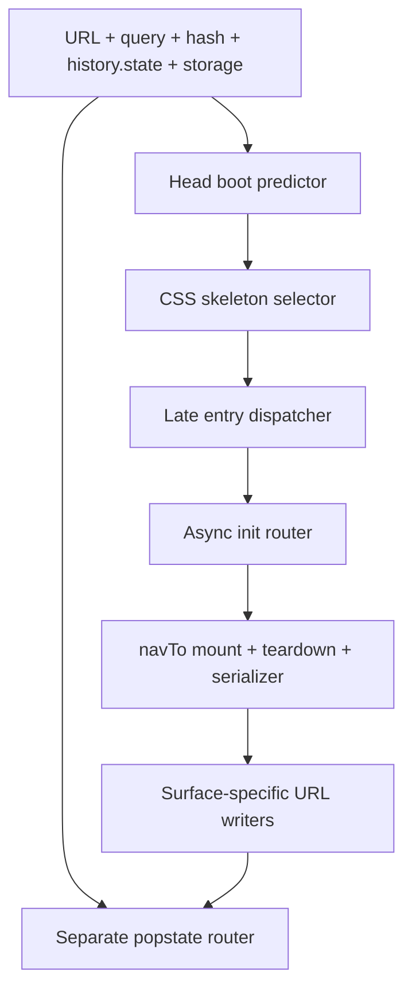

# SyncView boot, refresh, browser-history, and read-truth audit

> **Immutable evidence snapshot plus separately labelled publication and
> remediation addenda.** The
> controlled browser evidence records what was observed at
> `e238bc4f3a2685717b41aa16170e61d9a3cdc36f`. The separately labelled targeted
> source recon records current seams at `07d123d` and makes no browser or live
> execution claim. The remediation addendum records controlled synthetic-browser
> Calendar evidence at `86fe60c` separately from one source-only staff Analytics
> finding. Initial exact-head source review of unmerged draft #891 candidate
> `baa4ebf` found two release-control gaps. Candidate `02105e9` carries the
> source corrections for those two rows, but completed exact-head review of
> `02105e9` with audit companion `3189203` found seven further
> release-harness gaps. A later exact-head cloud source review at PR #891
> commit `59022d` expanded F176/F179 and found the client Brief async-lifetime
> gap F183; source inspection reconfirmed it at then-current candidate
> `93fc297`. Candidate `13c042b` was locally green but exact-head cloud source
> review (review `4741233371`; comments `3619424490`, `3619424493`) returned
> additional F176/F179 blockers: one workflow-direct client-entry probe was absent
> from the issuer registry, and one selector was independently validated against
> two non-identical catalogs. A prior cloud source review at `adb1bca`, reconfirmed at `13c042b`,
> separately found F184's pre-verification legacy-queue replay path. Current unmerged
> candidate `c9a79ef` closes the previously known F176 probe-registry omission and
> carries local remediation for F179/F184; it passed 150/150
> unit suites plus 23/23 actual visible boot groups. Its exact-head cloud source review
> (review `4741601566`; comment `3619744849`) returned one further F176 occurrence:
> `qa/overnight_runner.sh` retains the job's inherited `SYNCVIEW_STAFF_KEY` across its
> direct process tree before probe classification. Follow-up local source tracing found the
> transitive `qa/overnight_cron_chunk.sh` pass-through, unrelated helper inheritance and
> the missing declared broker for legitimate scenario/master consumers. This bypasses the
> 39-probe registry and expands F176 rather than creating F185. Remediation and
> another exact-head cloud review are pending; the stale current-truth review wording found in the same
> pass is corrected by this documentation update. The only non-source evidence
> in that continued review is isolated local synthetic Python/Playwright proof
> of the access/error/log propagation and inert, no-payload-execution
> substitution proof of the workflow-expression injection shape.
> Current status and remediation live in
> `docs/independence/CUTOVER_AUDIT_2026-07-13.md` (F149–F184) and
> `docs/truth/BRIEFING.md`; do not edit this audit to track later fixes.

## Evidence lock

| Field | Value |
|---|---|
| Capture date | 2026-07-19 |
| Audited repository | `sidney-afk/client-analytics` |
| Audited commit | `e238bc4f3a2685717b41aa16170e61d9a3cdc36f` |
| Production match at capture time | The downloaded production `index.html` and the audited commit both had SHA-256 `a43067865e7d41bbad45b34dfb07ee76c8b3f1cc1af3815829f0e8f06ec72f37` |
| Browser | Chromium through Playwright 1.56.1 |
| Data boundary | Synthetic fixtures only; no real client record, identity, credential, token, or private payload |
| Mutation boundary | Read-only; no application, database, workflow, flag, deployment, or live-data write |
| Publication revalidation | Root causes were rechecked in source and the high-confidence browser counterexamples were repeated with synthetic fixtures at `f00da65341797ec55f2f9a0d53b97e6bccd7056f`; `index.html` is byte-identical at the publication base `c722984cb86f66a6f14cba210e38963ac4779b0f` |
| Publication source-only expansion | Targeted current-source census at `07d123d` registered F163–F169 and expanded F29/F45/F130/F138/F152/F162. It made no browser/backend request and used no live data, identity, credential, secret body, or write. |
| Remediation controlled expansion | Controlled synthetic-browser Calendar sequences at current-source base `86fe60c` registered F170–F171: held primary/ancillary work, no-load exit, pagehide, real persisted BFCache, and visible client A → B replacement. All traffic and writes were intercepted; no live data, identity, credential, flag, backend, or live writer was used. |
| Remediation source-only expansion | Source inspection at `86fe60c` and draft #891 candidate `baa4ebf` registered F172. It made no browser/backend request and claims no runtime frequency. The candidate is unmerged; its exact-head review later registered the separate F173/F174 blockers below. |
| First remediation-review source-only expansion | Exact-head source review of draft #891 candidate `baa4ebf` registered F173–F174. No courier or browser command was run; no token was resolved; and no credential, request/response body, live data, flag, backend or writer was read or changed. |
| Second and continued remediation-review expansion | Exact-head source review completed on draft #891 candidate `02105e9` with audit companion `3189203`. Source inspection confirmed the candidate corrections for F173/F174, then registered F175–F182. The only non-source execution was isolated local synthetic proof: Python access logging plus a Playwright `goto` failure for F178, and inert command-shape substitution with no payload execution for F179. It used no real token or staff key, external network, backend/API, live data, flag or writer and read no protected credential/header value or real request/response body. F175/F176 and F178–F182 block merge pending remediation and post-remediation review; F177 is resolved by the current-truth correction in this documentation change. |
| Post-F182 exact-head cloud source review | Cloud source review at PR #891 commit `59022d` expanded F176/F179 and registered F183; source inspection reconfirmed F183 at then-current candidate `93fc297`. It found that the shared probe runner reattached the staff issuer key to every manually selected probe, that scenario selector handling allowed a valid component to mask empty/unknown components, and that purging client Brief state lost live polling/controller handles without terminating their work. No browser, backend, token, credential value, live data or write was used or executed. |
| Prior unmerged remediation candidate — local evidence only | PR #891 then-head `13c042b` passed `npm test` 149/149, direct visible boot 22/22 and `qa/master` boot 22/22. The added Brief scenario used real pagehide and `pageshow.persisted === true`, held polling plus tab-summary and both Brief-sheet responses, proved retirement/late-release denial, and observed one fresh generation. A synthetic issuer census reported exact agreement for 37 nightly manifest-derived client-entry probes plus one temporal probe, but did not inventory the additional workflow-direct Samples probe. An independent local rereview of that submitted remediation delta reported no P0/P1/P2 findings. This was local evidence, not cloud review, and the later cloud blockers show it was not release clearance. It made no live/backend/credential/write claim. |
| Prior exact-head cloud source review | PR #891 then-head `13c042b`, review `4741233371` and comments `3619424490`/`3619424493`, returned two P1 blockers without adding rows. F176's registry omitted workflow-direct `sxr_client_persist_guard.js`, which calls `sxr_courier_lib.client()` and therefore failed scheduled Samples without the staff issuer capability. F179 passed one `scn` to both flat and tree, but each runner validated every term only against its own non-identical catalog; legitimate flat-only `resolve_via` and tree-only selectors failed the sibling lane. Required correction: inventory every executable probe-selection path; validate a Samples selector once against the union; run only each lane's exact matches or skip it cleanly; and reject union-unknown selectors before loading the live harness. This was source review only; it used no browser, backend, token, credential value, live data or write. |
| Prior continued cloud source review | A cloud source review at PR #891 `adb1bca`, reconfirmed unchanged at then-current `13c042b`, registered F184: `_writeUiResumeLegacyQueues('startup')` and its focus/pageshow/online/visible/timer triggers ran on any client-link document before strict verification could settle, so residual same-origin staff/legacy debt could be read or replayed. This source-only finding used no browser, backend, token, live data or write. It remained affected and OPEN at that head; the later `c9a79ef` candidate locally remediates it, without closing the row before owner merge. |
| Latest unmerged remediation candidate — local evidence only | PR #891 exact head `c9a79efd1b21407f1aaf1fd714fc211a34db4371` passed `npm test` 150/150 and the streamed actual-visible client-entry lane 23/23, one attempt per navigation. The 39-probe census includes 37 manifest probes, workflow-direct `sxr_client_persist_guard.js`, and one temporal probe; selector validation uses the flat/tree/visual union; and the F184 guard drives exact-owner retry, Web-Lock finalization, real timeout, pagehide/BFCache cancellation and principal-only exclusion with synthetic data. This is local evidence, not cloud clearance. It used no real credential, client data, runtime flag, frozen writer, deployment or live write. |
| Latest exact-head cloud source review | PR #891 exact head `c9a79ef`, review `4741601566`, comment `3619744849`, returned one P1 occurrence under existing F176 and no new numbered finding. When an operator supplies `SYNCVIEW_STAFF_KEY`, `qa/overnight_runner.sh` retains it before direct-child classification. Follow-up local source tracing found the transitive `qa/overnight_cron_chunk.sh` entry forwarding both credentials. Staff-only and Calendar probes, unknown/manual paths, cleanup, unit, timeout/log/readiness/Git helpers and wrapper processes therefore receive an issuer they do not need. The static server and browser/courier boundary are already credential-stripped and must remain so. Scenario and master runners legitimately need the staff issuer, but currently receive it through ambient inheritance rather than an explicit declared broker; the 39-entry registry governs probes only. Required correction: capture then unset both credentials at each shell entry, default every descendant to clean, restore only the staff issuer for registry-approved probes and declared scenario/master brokers at the final operative Node boundary, never restore the legacy token, and never expose either value through a timeout/wrapper argv, log or output. Add actual shell-launch and cron-handoff guards for every permitted and denied class. The cloud review executed no command; the follow-up executed no QA runner/probe/helper command, browser, credential value, backend, live data or write. F179/F184 received no separate thread at this head but remain OPEN through owner merge; #891 remains blocked on F176 remediation and exact-head cloud re-review. |

The browser harness intercepted external requests and returned fictional data.
It exercised cold and warm boot, hard reload, a second reload, browser Back and
Forward, modifier-click/new tab, saved navigation, native fragment changes,
blocked storage, HTTP errors, aborted requests, and deliberately pending
requests. Early state was captured at `DOMContentLoaded` and controlled
follow-up intervals. The harness did **not** instrument the browser's literal
first-paint timestamp, so this audit uses “early boot frame,” not “first paint,”
for that evidence.

## Executive verdict

SyncView was not boot-perfect at the audited commit. Major routes generally
settled on the intended page, but early-shell prediction, async readiness, URL
restoration, ordinary navigation, and Back/Forward were owned by several
partly duplicated routers. They usually converged, but did not share one route
contract.

The reported client-facing symptom was reproduced: hard-reloading a client's
Calendar or Brief showed the full Analytics overview in the early boot frame
before switching to the requested client section. The same audit also found
functional failures: a direct Samples Review boot could strand Analytics with
no loaded clients, HTTP 500 responses could look like valid empty data,
blocking requests could leave skeletons indefinitely, Back could retain stale
page modes, and supported detail links could lose the state needed for a
second reload.

This was not evidence that every route was broken. Healthy controls included
the password gate, ordinary Home, direct `?prod=1`, top-level Workload,
top-level Calendar under healthy dependencies, Templates client detail, and
standalone onboarding/intake in the controlled captures.

## Findings ledger

The audit IDs below are local to this immutable report. The F-number is the
durable owner in the cutover register.

| Audit ID | Sev | Observation at `e238bc4` | Evidence | Durable owner |
|---|---|---|---|---|
| BA-01 | P1 | Client Calendar and Brief reloads exposed the Analytics heading, search, active nav, and table skeleton before the requested client tab mounted. | Browser + source | F149 |
| BA-02 | P1 | Direct Samples Review returned before the shared Analytics load was created; later entering Home rendered a zero-client dashboard from an untouched model. | Browser + source | F150 |
| BA-03 | P1 | Analytics reads parsed HTTP 500 response bodies without checking `response.ok`, allowing a normal-looking empty dashboard instead of a visible failure. | Browser + source | F151 |
| BA-04 | P1 | Stored-staff verification, cold Analytics reads, and client-link verification had no application deadline; deliberately pending requests had no terminal UI state. | Browser + source | F152 |
| BA-05 | P1 | Back to a client profile used a special renderer that skipped the normal teardown/reset lifecycle, leaving stale body modes and two active top-level destinations. | Browser + source | F153 |
| BA-06 | P1 | Calendar card, Samples Review client/card, and direct Kasper subtab routes did not round-trip through parse → mount → serialize; later reloads could lose detail state. | Browser + source | F154 |
| BA-07 | P2 | Time Off, Weekly, several Kasper subtabs, Templates index, Submit, and TikTok Pilot reused a visibly different surface's early shell. | Browser + source | F155 |
| BA-08 | P2 | The visible Production anchor advertised `#production`, but independent boot recognized the query form; modifier-click/new tab therefore landed on Home. | Browser + source | F156 |
| BA-09 | P2 | Weekly Reports filters replaced the current entry with `history.state === null`; a later Back could restore a Weekly URL with Analytics DOM and stale Calendar mode. | Browser + source | F157 |
| BA-10 | P2 | A failed direct-Calendar prerequisite could leave an empty “Refreshing…” shell with no visible failure or retry while only the console recorded the failure. | Browser + source | F158 |
| BA-11 | P2 | Blocking first-party storage caused unguarded main-script `localStorage` reads to throw and abort boot after the defensive head gate had succeeded. | Browser + source | F159 |
| BA-12 | P2 | The app had a `popstate` owner but no `hashchange` owner; a native fragment change could update the URL while Home remained mounted. | Browser + source | F160 |
| BA-13 | P2 | Samples Review was persisted as the last navigation target but omitted from both bare-root restore lists, so a new plain-root boot opened Home and overwrote it. | Browser + source | F161 |
| BA-14 | P1 release evidence | No pull-request browser lane watched the actual visible sequence across every route's cold boot, refresh, Back, Forward, slow response, 5xx, and never-settling response. Settled-page and source-parity tests missed the defects above. | Test census + browser counterexamples | F162 |

## Publication source-only targeted recon

These entries extend route coverage without upgrading their proof. They were
confirmed in current source at `07d123d`; no browser, backend, live data,
identity, credential, secret body, or write was used. Each remains open until
F162 drives the actual visible route sequence through failure, Retry, and
recovery.

| Recon ID | Sev | Current-source observation | Source seams | Durable owner |
|---|---|---|---|---|
| SR-01 | P1 | Brief tab/general/content synthesis can parse a 5xx body as output, suppress or auto-retry errors, poll stale arrays, and cache invalid output. | `index.html:7541-7594`, `:7733-7909`, `:8326-8335`, `:8578-8756`, `:9750-9833` | F163 |
| SR-02 | P1 | Samples Review's fallback can parse a failed/error response and republish it as `{ok:true, posts:[]}`, making unavailable data authoritative empty. | `index.html:42971-43030` | F164 |
| SR-03 | P1 | Top-level Filming can remount an unbounded failed load into another skeleton; Kasper Filming converts runway/month read failures to “No scheduled content.” | `index.html:11979-12263`, `:51553-51783` | F165 |
| SR-04 | P1 | Onboarding list failures can hide a client-profile entry, and standalone failure can render “No onboarding form on file.” | `index.html:10897-10984` | F166 |
| SR-05 | P2 | Weekly Reports has no read deadline and accepts empty/malformed success as empty managers/reports before painting “No reports match.” | `index.html:19518-19558`, `:19874-19923` | F167 |
| SR-06 | P1 | Credentials list/modal/history reads can hang; malformed success can render “No credentials” or “No history yet.” | `index.html:51045-51133`, `:51332-51342`, `:51407-51425` | F168 |
| SR-07 | P2 | Kasper Editors accepts a 200 `{}` as cacheable data and paints missing editors as “No editor deliveries last week”; a held request never leaves its skeleton. | `index.html:53999-54060` | F169 |

## Remediation-phase evidence addendum

This later addendum does not rewrite the original `e238bc4` route snapshot or
upgrade the F163–F169 source-only evidence. It records two newly reproduced
Calendar lifetime failures against current-source base `86fe60c`, then one
separately labelled source-only staff Analytics gap. The controlled browser used
only fictional clients/rows and intercepted all reads and writer calls. Draft
#891 candidate `baa4ebf` was inspected as the first proposed guard. Candidate
`02105e9` carries the source corrections for F173/F174, but completed exact-head
review of `02105e9` with audit companion `3189203` found F175/F176 and
F178–F182. Those rows are source-only except for isolated local synthetic
Python/Playwright proof on F178 and inert, no-payload-execution substitution
proof on F179; no protected credential, external network, backend/API, live
data or writer was used. The draft remains unmerged; F170/F171 stay open, while
F177 closes only the stale current-truth wording corrected in this documentation
change. A later exact-head cloud source review at PR #891 commit `59022d`
expanded F176/F179 and found F183; source inspection reconfirmed F183 at
then-current candidate `93fc297`. Candidate `13c042b` carries
local remediation and passed 149/149 unit suites plus both direct and master
visible boot lanes at 22/22. Its real pagehide / `pageshow.persisted` Brief guard
passed; its issuer census reported agreement for 37 nightly manifest-derived
probes plus one temporal probe, and an independent local exact-head rereview
reported no P0/P1/P2 findings. Exact-head cloud source review of `13c042b`
(review `4741233371`; comments `3619424490`, `3619424493`) then showed that the
census omitted one workflow-direct client-entry probe (F176) and that legitimate
catalog-specific Samples selectors fail the sibling flat/tree lane (F179). The
local results were not cloud review or release clearance. A prior exact-head cloud source
review at `adb1bca`, reconfirmed at `13c042b`, separately found F184, so the
candidate remains blocked and unmerged. Neither source review used a browser,
backend, token, live data or write. Current candidate `c9a79ef` locally closes the
previously known F176 probe-registry omission plus the F179/F184 boundaries and
passed 150/150 unit suites plus 23/23 actual
visible groups. Exact-head cloud source review `4741601566` / comment
`3619744849` then found that `qa/overnight_runner.sh` still exposes an inherited
staff issuer to its direct process tree outside the 39-probe registry. Follow-up
local source tracing confirmed that staff-only/Calendar/unknown/manual/cleanup/
unit/helper children do not need it, scenario/master need it only through an
explicit broker, and `qa/overnight_cron_chunk.sh` transitively forwards both
credentials into the same unsafe entry. This is an expanded F176 source seam,
not a new row; no QA runner/probe/helper command, credential value, browser,
backend, live data or write was used for either source finding.

| Addendum ID | Sev | Observation | Evidence | Durable owner |
|---|---|---|---|---|
| RA-01 | P1 | Calendar's primary request, post-load Linear/meta continuations, realtime channel/timers, loader state, and deferred render did not share one document/surface owner. Held work and channel ownership could survive client/route no-load exits, pagehide, or real persisted-BFCache restore, while a stale completion/finally raced replacement state. | Controlled synthetic browser + source at `86fe60c`; proposed generation/controller/realtime-epoch guard inspected at unmerged `baa4ebf` | F170 |
| RA-02 | P0 | A held client-A v1 Linear reconcile could resume after a visible switch to client B, consult mutable current Calendar state, mutate B, seed B suppression/pending state, and enqueue an intercepted Calendar write under B. This is a cross-client integrity/confidentiality failure, not only stale UI. | Controlled synthetic A → B browser + source at `86fe60c`; proposed ancillary lease/abort and visible-sequence guard inspected at unmerged `baa4ebf` | F171 |

| Addendum ID | Sev | Source-only observation | Source seams | Durable owner |
|---|---|---|---|---|
| RS-01 | P1 | Staff Analytics bootstrap has no document/BFCache run or abort lease. Current main has no bootstrap run owner; draft #891 adds one only for client links, passes `null` for staff, and its suspension handler exits for staff. No browser reproduction or runtime-frequency claim is made. | Current-main `fetchAll()`/bootstrap at `index.html:8320-8330`, `:41918`; unmerged candidate `fetchAll(_isClientLink ? clientEntryRun : null)` and `_syncviewSuspendClientEntry()` at `baa4ebf` | F172 |

| Addendum ID | Sev | Remediation-review source-only observation | Source seams | Durable owner |
|---|---|---|---|---|
| RR-01 | P1 | The EF write-path courier is newly coupled to the protected TEST client token but writes request and response bodies to undeleted files, passes URLs and headers through a shell-built curl command, and returns command-bearing execution errors. The intended client-entry drill can therefore leave or expose credential-bearing material on the runner. No token or command was exercised. | Unmerged `baa4ebf`: `qa/ef-writepath/lib.js:32`, `:97-113`, `:343`, `:386`; strict client preflight/body and EF header attachment in `index.html` | F173 |
| RR-02 | P1 | The read-first overnight protocol still prescribes a client Samples URL with no token and with a query key forbidden by the strict candidate. It will be rejected before reaching the intended client surface, so following the operative recipe cannot prove the client-entry boot boundary. No browser run or token resolution was performed. | Unmerged `baa4ebf`: `.claude/skills/overnight-test/SKILL.md:92-98`; strict envelope in `index.html`; canonical builder in `qa/test-client-entry.js:39-51` | F174 |
| RR-03 | P1 | Candidate `02105e9` makes the browser courier and write helpers fileless, but three direct shared SXR REST helpers still build shell curl commands containing the protected request URL plus authorization headers. Their `execSync` failure object can retain the full command. This is a second network path outside the F173 guard. No helper command was run and no URL/header value was inspected. | Unmerged `02105e9`: `_exec`/shell construction in `qa/sxr_courier_lib.js:101-118`; direct `supa()`, `supaEvents()`, and `supaCal()` curl calls at `:242-248`, `:519-521` | F175 |
| RR-04 | P1 | At `02105e9`, both nightlies exported the resolved TEST token through `GITHUB_ENV`, making it job-wide. The later candidate replaced that export, but exact-head cloud source review at `59022d` found `run-probes` reconstructing `SYNCVIEW_STAFF_KEY` into every manually selected probe child, including non-client probes that do not need client-entry capability. At `13c042b`, a local census covered 37 manifest-derived nightly client-entry probes plus one temporal probe, but cloud review `4741233371` / comment `3619424490` found the omitted workflow-direct `sxr_client_persist_guard.js` issuer consumer. Current `c9a79ef` expands the immutable registry to all 39 registered probe consumers and locally closes that omission, but cloud review `4741601566` / comment `3619744849` plus follow-up source tracing found a separate process-boundary bypass. `qa/overnight_runner.sh` retains an operator-supplied `SYNCVIEW_STAFF_KEY`; its transitive `qa/overnight_cron_chunk.sh` entry forwards both credentials. Staff-only and Calendar probes, unknown/manual commands, cleanup, unit, timeout/log/readiness/Git helpers and wrappers inherit an issuer they do not need. The static server and browser/courier boundary are already stripped. Scenario and master are legitimate client-entry consumers, but they too receive the key ambiently instead of through an explicit declared broker. The credential owner therefore includes both shell entries and every descendant process, not only probe catalogs. This is further evidence for F176, not F185. No token or staff-key value was resolved, read or executed. | Unmerged `02105e9`: `qa/test-client-entry.js:92-108` and both nightly workflows; unmerged `59022d`: `qa/run-probes.js:109-115`; `13c042b`: `.github/workflows/samples-e2e-nightly.yml:42-54`, `qa/probes/sxr_client_persist_guard.js:10-27`, `qa/test-client-entry.js:13-52`; current `c9a79ef`: protected server launch at `qa/overnight_runner.sh:45-50`, unsafe direct process paths at `:91-243`; `qa/overnight_cron_chunk.sh:27-59`; cloud review `4741601566`, comment `3619744849` | F176 |
| RR-05 | P2 | The living APP and SYSTEM_MAP still said Calendar cloud review was pending after exact-head review had completed and returned the F175/F176 blockers. A read-first session could therefore miss both new release gates. This is documentation drift only; no runtime behavior was inspected. | Audit companion `3189203`: `docs/truth/APP.md:50-55`; `docs/independence/SYSTEM_MAP.md:318-325`; completed source-only review of candidate `02105e9` | F177 |
| RR-06 | P1 | The strict client path carries the TEST token in its query string. The Samples nightly starts a static server without redirecting its access stream, while the shared browser opener navigates to the full token-bearing target and probe/master runners retain and tail child output. A failed or logged navigation can therefore publish the token through the server access line or a Playwright `goto` error even when application helpers sanitize their own failures. Isolated local Python-access-log and Playwright-`goto`-failure checks reproduced this propagation with a synthetic marker only; they used no real token, external network, backend/API or live data. | Unmerged `02105e9`: static-server step in `.github/workflows/samples-e2e-nightly.yml:45-57`; full-target navigation in `qa/sxr_courier_lib.js:473-478`; failure-output retention in `qa/run-probes.js:62-73` and `qa/master.js:133-157`, `:168-176` | F178 |
| RR-07 | P1 | At `02105e9`, user-controlled `workflow_dispatch` values were embedded directly into credential-bearing shell commands; inert synthetic substitution confirmed the command-shape break without payload execution or a real credential. The later environment-based handoff removed that shell shape, but cloud source review at `59022d` found the selector pipeline still fail-open: empty comma components were discarded and a partial valid-plus-unknown selector could run the valid match instead of rejecting the complete dispatch value. The then-current exact-head cloud review `4741233371` / comment `3619424493` found a different remaining defect at `13c042b`: `qa/master.js` sent the one workflow `scn` to both flat and tree runners, and each `run_scenarios.js` invocation independently required every term to match only the catalog it loaded. Because the catalogs differ, a legitimate flat-only selector such as `resolve_via` failed tree, while a legitimate tree-only selector failed flat. Validate the complete value once against the union, run only each lane's exact matches or skip it cleanly, and fail a union-unknown value before either live harness loads. No credential, browser, backend or live scenario was executed for the added evidence. | Unmerged `02105e9`: both nightly workflow inputs/steps and `qa/test-client-entry.js:92-108`; unmerged `59022d`: `qa/nightly-input.js:24-32`, `qa/probes/run_scenarios.js:11-20`; then-current `13c042b`: `.github/workflows/samples-e2e-nightly.yml:19-43`, `qa/master.js:287-304`, `:375`, `qa/probes/run_scenarios.js:6-32`, `qa/scenarios.js:459-475`, `qa/scenario_tree.js:24-37` | F179 |
| RR-08 | P1 | The full-quota navigation probe implements its own courier: it serializes the intercepted URL and headers into shell curl argv, writes each request body and response headers to predictable runner files, and does not remove those files. This bypasses the shared hardened transport and its guard. No probe/helper command, request body, response header or credential was run or read. | Unmerged `02105e9`: `qa/probes/p94_nav_full_quota.js:12-37` | F180 |
| RR-09 | P1 | Two EF write-path helpers retain direct shell/file transports outside the common guard. The drift checker puts its REST URL and authorization headers into curl argv, while the settings safety-restore writes the restore body to a runner file, shells out to curl, leaves the file behind, and can print a command-bearing error. No helper command, key/header value, body, backend data or writer was run or read. | Unmerged `02105e9`: `qa/ef-writepath/21-drift-check.js:9-18`, `:34-36`; `qa/ef-writepath/13-settings.js:64-75` | F181 |
| RR-10 | P1 | The optional vision API backend puts `ANTHROPIC_API_KEY` in curl argv, writes the screenshot-plus-prompt request payload to a runner file, and returns `execSync`'s command-bearing message on failure. `finally` cleanup does not protect the argv/error surface or abrupt termination before unlink. No API key, screenshot/body, helper command or API response was read or exercised. | Unmerged `02105e9`: `qa/vision_judge.js:84-124` | F182 |
| RR-11 | P1 | `_syncviewPurgeClientEntrySurface()` clears `briefPollingState` and `tabSummaryCache` without first clearing the polling intervals held by the former state or aborting the per-request controllers created by `fetchTabSummary()`. Pagehide/BFCache capability revocation can therefore lose the cancellation handles while detached polls and summary requests continue into late global-state, cache/localStorage and render mutations. This was source-only: no browser, backend, token, live data or write was used. | Unmerged PR #891 `59022d`: `index.html:7626-7660`, `:8820-8868`, `:42638-42649`; source reconfirmed at then-current candidate `93fc297` | F183 |
| RR-12 | P1 | `_writeUiResumeLegacyQueues('startup')` and its focus/pageshow/online/visible/timer listeners ran on every client-link document while strict verification was pending or could fail. Residual same-origin Calendar/Samples/Linear/intake repair debt from a prior staff/session context could therefore be read, drained or replayed before an invalid/rotated link reached terminal UI. This is persisted cross-session queue ownership, distinct from F171's held client-A Calendar continuation. Source review established reachability only; it did not execute a browser, backend, token, live data or write. | Unmerged PR #891 `adb1bca`, reconfirmed at then-current `13c042b`: `_writeUiResumeLegacyQueues()` and lifecycle registrations at `index.html:48334-48382`; later candidate `c9a79ef` locally remediates this path | F184 |

## Existing findings that overlap but were not renumbered

| ID | Sev | Why it matters to boot/remediation |
|---|---|---|
| F102 | P0 | A client-entry read-boundary precedence defect can let an unknown `?c=` route bypass the password/token verifier and fall through to a staff surface. This audit did not demonstrate or claim an unauthorized mutation. |
| F117 | P0 | A legacy client Samples link can lose its verified client binding when redirected into generic Samples Review. |
| F121 | P2 / policy | Kasper's visible subtab changes use replace-state; whether Back should traverse those tabs remains an owner history-policy decision. This is separate from F154's loss of a supplied deep link. |
| F127 | P1 | Refresh does not prove that a stale running build was retired; the update notice is advisory rather than an enforced caller epoch. |
| F29 | P1 | Workload can retain an “As of” snapshot as current after an unbounded issue read fails; the active workflow completeness defect remains the same owner. |
| F45 | P1 | A failed/unbounded Linear project read can become “No projects loaded”; this extends the existing incomplete picker owner. |
| F130 | P2 | Kasper Review/Messages cold-load failures can leave an indefinite skeleton or a dead-end error, while partial or total per-client failures can be adopted as a successful queue. |
| F138 | P2 / P1 before history retirement | Production now requests events for status history, but failure collapses to an empty array and Activity remains invisible; this corrects the earlier no-runtime-caller observation without claiming browser proof. |

F102 and F117 remain client-entry P0s. They precede visual boot polish because
an exact shell is not a sufficient safety boundary if the route itself is not
fail-closed.

## Why the failures cluster

At the audited snapshot, one requested destination was interpreted or rewritten
by several independent owners:



The copies disagreed in concrete ways:

- the head predictor knew a client profile existed but ignored its `clientTab`;
- direct Samples Review returned before the shared Analytics load was created;
- `popstate` rendered a client directly while normal navigation owned the full
  nav/body/teardown reset;
- deep-link parsers captured detail state, then `navTo()` serialized only the
  top-level route;
- the Production click handler created a bootable query URL while its anchor
  exposed a different, non-bootable hash URL;
- Weekly filters discarded the route's history state;
- source-parity tests checked duplicated strings, not what a user could see
  between document start and settlement.

The durable repair is one route descriptor and one transition lifecycle used
for prediction, boot, clicks, reload, Back/Forward, and native URL changes.

## Exception-focused route matrix

| Surface / entry | Early boot frame | Refresh/second refresh | Back/Forward result | Snapshot verdict |
|---|---|---|---|---|
| Password gate | Opaque password overlay | Correct under ordinary storage | N/A | Healthy control; F159 covers blocked storage |
| Analytics Home | Matching shell | Healthy reads settle correctly | Ordinary top-level history works | F151/F152 can fake empty or hang |
| Client Analytics | Matching shell | Settles correctly | Can inherit stale prior route mode | Mostly healthy destination |
| Client Calendar | **Full Analytics overview** | Eventually correct | Return can leave Calendar and Analytics active | F149/F153 |
| Client Brief | **Full Analytics overview** | Eventually correct | Return can retain prior route state | F149/F153 |
| Calendar detail | Calendar shell | First mount can consume the detail; serializer can erase it before the next reload | Detail is not reliably round-trippable | F154 |
| Samples Review | Matching Review shell | Exact top-level hash loads; detail route can be one-shot | Direct boot can leave later Home empty | F150/F154/F161 |
| Workload | Matching shell | Correct in the controlled fixture | Return to client was clean | Healthy control |
| Templates client detail | Matching detail shell | Client and tab restored | Return to client was clean | Healthy control |
| Production `?prod=1` | Matching Production shell | Dedicated boot passed | Production-focused history passed | Healthy control; F127 remains |
| Production `#production` | Analytics, then Home | Does not mount Production independently | New-tab contract broken | F156 |
| Time Off | Analytics table shell | Eventually PTO | Client return was clean | F155, not a Back defect |
| Kasper direct subtab | Generic Review shell for most subtabs | First mount can be right; URL collapses to `#kasper` | A later reload can land Review | F154/F155 |
| Weekly Reports | Reused Kasper shell | Direct boot settles | Filtered null-state entry can restore a hybrid page | F157 |
| Standalone onboarding/intake | Special mode hides workspace chrome | Clean in controlled post-parse captures | Standalone | Healthy controlled capture |

## Evidence details

### BA-01 — client Calendar/Brief early shell

Client tabs saved both `client` and `clientTab`. The head predictor returned as
soon as it saw `state.client`, without selecting a matching boot shell. CSS
therefore exposed the default Analytics skeleton until the late router restored
the client tab.

Snapshot source:

- [head predictor](https://github.com/sidney-afk/client-analytics/blob/e238bc4f3a2685717b41aa16170e61d9a3cdc36f/index.html#L27-L145)
- [boot skeleton selector](https://github.com/sidney-afk/client-analytics/blob/e238bc4f3a2685717b41aa16170e61d9a3cdc36f/index.html#L1758-L1775)
- [late client-state restore](https://github.com/sidney-afk/client-analytics/blob/e238bc4f3a2685717b41aa16170e61d9a3cdc36f/index.html#L41388-L41397)

### BA-02/BA-03/BA-04 — readiness and failure truth

The direct Samples Review branch returned before `fetchAll()` was created.
Analytics fetches used plain `fetch()` plus body parsing, so HTTP errors did not
reject. Cold Home awaited both essentials and optional extras. Staff and
client-link verification also used awaited fetches without an application
deadline.

Snapshot source:

- [Analytics fetch coordinator](https://github.com/sidney-afk/client-analytics/blob/e238bc4f3a2685717b41aa16170e61d9a3cdc36f/index.html#L8251-L8284)
- [staff verifier](https://github.com/sidney-afk/client-analytics/blob/e238bc4f3a2685717b41aa16170e61d9a3cdc36f/index.html#L17286-L17298)
- [direct Samples Review boot](https://github.com/sidney-afk/client-analytics/blob/e238bc4f3a2685717b41aa16170e61d9a3cdc36f/index.html#L41020-L41030)
- [cold Home wait and client-link verification](https://github.com/sidney-afk/client-analytics/blob/e238bc4f3a2685717b41aa16170e61d9a3cdc36f/index.html#L41342-L41503)

### BA-05/BA-06 — history and round-trip state

The client `popstate` branch directly toggled a subset of navigation and rendered
the client. It bypassed the broader reset/teardown lifecycle in `navTo()`.
Calendar, Samples Review, and Kasper boot paths parsed details, then the common
serializer replaced the URL with only the top-level destination.

The controlled Calendar example used the fictional route:

```text
#calendar/demo-client/card-1
```

No real roster or client identifier is needed to reproduce the serializer
failure.

Snapshot source:

- [client popstate branch](https://github.com/sidney-afk/client-analytics/blob/e238bc4f3a2685717b41aa16170e61d9a3cdc36f/index.html#L10210-L10249)
- [normal transition and serializer](https://github.com/sidney-afk/client-analytics/blob/e238bc4f3a2685717b41aa16170e61d9a3cdc36f/index.html#L15738-L15927)
- [Calendar detail parser](https://github.com/sidney-afk/client-analytics/blob/e238bc4f3a2685717b41aa16170e61d9a3cdc36f/index.html#L41261-L41280)
- [Calendar URL synchronizer](https://github.com/sidney-afk/client-analytics/blob/e238bc4f3a2685717b41aa16170e61d9a3cdc36f/index.html#L21663-L21673)
- [Samples Review one-shot deep state](https://github.com/sidney-afk/client-analytics/blob/e238bc4f3a2685717b41aa16170e61d9a3cdc36f/index.html#L41922-L41948)
- [Kasper subtab URL writer](https://github.com/sidney-afk/client-analytics/blob/e238bc4f3a2685717b41aa16170e61d9a3cdc36f/index.html#L50208-L50223)

### BA-07 through BA-13 — route consistency

These findings are individually lower severity, but they are the same class:
the URL a user can reach, the shell shown while it boots, the serialized
history state, and the mounted destination do not share one owner.

Snapshot source:

- [boot-shell mappings](https://github.com/sidney-afk/client-analytics/blob/e238bc4f3a2685717b41aa16170e61d9a3cdc36f/index.html#L1758-L1775)
- [visible Production anchor](https://github.com/sidney-afk/client-analytics/blob/e238bc4f3a2685717b41aa16170e61d9a3cdc36f/index.html#L6880-L6900)
- [Weekly filter history writer](https://github.com/sidney-afk/client-analytics/blob/e238bc4f3a2685717b41aa16170e61d9a3cdc36f/index.html#L19345-L19360)
- [saved-route and entry dispatcher](https://github.com/sidney-afk/client-analytics/blob/e238bc4f3a2685717b41aa16170e61d9a3cdc36f/index.html#L40999-L41590)

## Snapshot test and size record

These values belong to `e238bc4`; they are not current-main measurements.

| Check | Snapshot result |
|---|---:|
| `npm test` | 135/135 suites passed |
| Production behavior guards | 168/168 passed |
| Production detail → Back → Forward → reload | Passed |
| Production boot-budget suite | Passed |
| `index.html` raw size | 3,747,128 bytes |
| Live compressed HTML response | 857,254 bytes |
| Lines | 54,765 |

The passing tests did not contradict the browser findings:

- `test/boot-gate-parity.js` asserted source/string parity, not visible frames;
- `test/pto-ui-wiring.js` treated the Time Off → Analytics shell mapping as
  correct wiring;
- Production browser coverage was intentionally Production-specific;
- Templates “refresh routing” coverage was primarily source assertions;
- no pull-request lane held a dependency pending forever, returned an HTTP 500
  body to Analytics, reloaded a deep link twice, or entered Home after a direct
  Samples Review boot.

## Accepted remediation order

1. **Client-facing entry first:** F149 plus the already-open F102/F117 P0
   boundaries, followed by the newly reproduced Calendar lifetime and
   cross-client continuation boundaries in F170/F171 and source-only client
   Brief async-lifetime boundary F183. Draft #891 exact head `02105e9` carries
   the F173/F174 source corrections, but continued review through `59022d`
   found F175/F176 and F178–F183. Candidate `13c042b` carried local remediation,
   but exact-head cloud review returned the additional workflow-direct capability
   gap in F176 and cross-catalog selector gap in F179; a prior review added F184.
   Current candidate `c9a79ef` locally closes the previously known F176
   probe-registry omission plus F179/F184 and is
   green at 150/150 unit suites and 23/23 actual visible groups, but exact-head
   cloud review found the remaining `qa/overnight_runner.sh` issuer inheritance
   under F176; follow-up source tracing added the cron pass-through and missing
   explicit scenario/master broker boundary. It remains only a candidate until F176 is remediated,
   every open row passes post-remediation exact-head cloud review, and the owner
   merges. F177 is the resolved documentation-truth
   correction from that review.
2. **Silent failure class:** F151, F152, F158, F163–F169, and the expanded
   F29/F45/F130/F138 owners. A transport, envelope, schema, completeness, or
   deadline failure must fail visibly, preserve last-good data only when
   identified as stale, and offer retry; it must never become fake-empty
   business data.
3. **Staff flows:** F150, F153, F154, and source-only F172—Samples Review →
   Analytics, stale Back/Forward modes, lost detail state, and a staff Analytics
   document/BFCache bootstrap lease. F172 still requires browser reproduction.
4. **Secondary route consistency:** F155–F161 after the higher-impact slices.

Every remediation must satisfy F162 with a browser guard that drives the
actual visible boot sequence for the route. A test that begins only after the
page settles is not sufficient.

The frozen `calendar-upsert` and `sample-review-upsert` writers are outside this
work. No runtime-flag change is required. Any live drill must use only the
private TEST fixture; synthetic browser tests remain preferred for failure
injection.

## Acceptance contract

A boot/history fix is complete only when:

- the earliest captured workspace belongs to the requested destination;
- exactly one top-level destination and one body mode are active;
- URL, parsed route, `history.state`, selected client/subtab/detail, and mounted
  surface agree;
- direct link → reload → second reload is idempotent;
- actual Back → Forward → Back runs the same teardown/mount lifecycle as clicks;
- modifier-click/new tab reaches the destination advertised by the anchor;
- every blocking dependency reaches content, an identified degraded state, or
  a retryable error within a bounded deadline;
- HTTP 4xx/5xx, parseable error envelopes, and malformed 200 responses cannot
  become valid output or an empty domain result;
- confirmed empty requires a complete, schema-valid success receipt;
- visible keyboard/touch Retry recovers without reloading the document;
- route exit prevents stale async completion from repainting the page left
  behind;
- a single current Calendar generation owns primary, ancillary, realtime,
  loader and deferred-render state through its terminal tail;
- client replacement, no-load exit and pagehide revoke that exact generation,
  while persisted pageshow starts exactly one fresh owner;
- a held client-A continuation released after a visible A → B switch produces
  zero B mutation, cache/meta persist, writer enqueue, suppression token or
  repaint;
- every client Brief polling interval and tab-summary request is owned by the
  current client-entry generation, revoked before its state map is cleared, and
  unable to mutate state, cache/localStorage or visible output after pagehide;
- a held Brief poll and tab-summary response released across actual visible
  pagehide → persisted BFCache restore produces zero stale mutation/paint and
  exactly one healthy replacement generation;
- no client-link document—valid, missing, invalid or rotated—reads or drains
  staff/legacy persisted retry debt on startup, focus, online, visibility,
  timer or real persisted-BFCache resume; that debt remains byte-for-byte until
  exactly one current verified staff-session owner resumes it;
- staff Analytics bootstrap work is aborted/replaced with the document/BFCache
  generation before any late global-data, cache or render continuation;
- the QA lane records early frames and transitions, not only settled DOM.

## Limitations

- Synthetic delays made intermediate states observable; they are evidence of
  state transitions, not production real-user timing.
- No route-specific real-user monitoring percentile was available.
- External fonts, media, and third-party scripts were blocked; expected fixture
  warnings were excluded.
- No live write or destructive failure injection was performed.
- SR-01–SR-07 and the publication-time existing-owner expansions are source-only
  targeted recon. They identify reachable code paths, not reproduced browser
  outcomes; their required synthetic visible guards remain open under F162.
- RA-01/RA-02 are controlled synthetic-browser evidence from the remediation
  phase; they do not claim production frequency or a live client/write. RS-01
  (F172) is source-only and still needs a staff-browser reproduction.
- RR-01 through RR-12 (F173–F184) are exact-head review findings. They are
  source-only except for isolated local synthetic Python/Playwright proof of
  F178's access/`goto`-error/log propagation and inert, no-payload-execution
  substitution proof of F179's workflow-expression injection. No protected
  token, staff/API key, external network, backend/API, real request/response,
  live data or live write was used, and no production occurrence or runtime
  frequency is claimed. The later F176/F179 expansions—including exact-head
  review `4741233371` at `13c042b` and F176 review `4741601566` at `c9a79ef`—and F183/F184 evidence are source-only; no
  browser, backend, credential, live scenario, live data or write was used for
  those reviews.
- Draft #891 candidates `baa4ebf`, `02105e9`, `59022d`, `93fc297`, `adb1bca`,
  `13c042b` and `c9a79ef` are cited only as inspected, unmerged source. `02105e9` carries the F173/F174 source
  corrections, while continued review through `59022d` found F175/F176 and
  F178–F183. Candidate `13c042b` carries local remediation for those rows, but
  exact-head cloud review returned remaining F176/F179 blockers and F184 remained
  affected. Current `c9a79ef` locally closes that earlier F176 omission and
  remediates F179/F184; it passed 150/150
  plus 23/23 actual visible groups, but exact-head cloud review returned the
  overnight-runner direct-child inheritance under F176. Local proof and the
  absence of separate F179/F184 threads at that head do not close rows before
  owner merge. F176 requires remediation and all open
  rows require post-remediation exact-head cloud review; F177 is
  resolved by this docs-only correction. The draft still does not close
  F170/F171 or remediate F172, and every candidate row stays open through owner merge.
- Whether Back should traverse replace-only filters and Kasper subtabs remains a
  product policy question. Losing a supplied deep link, showing two active
  routes, or restoring a hybrid page is a defect regardless of that decision.
