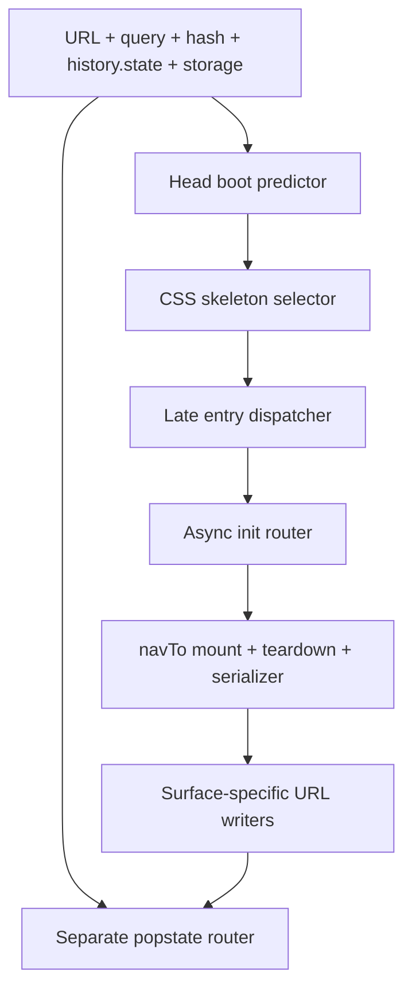

# SyncView boot, refresh, and browser-history audit

> **Immutable evidence snapshot.** This document records what was observed at
> `e238bc4f3a2685717b41aa16170e61d9a3cdc36f`. Current status and remediation
> live in `docs/independence/CUTOVER_AUDIT_2026-07-13.md` (F147–F160) and
> `docs/truth/BRIEFING.md`; do not edit this audit to track later fixes.

## Evidence lock

| Field | Value |
|---|---|
| Capture date | 2026-07-19 |
| Audited repository | `sidney-afk/client-analytics` |
| Audited commit | `e238bc4f3a2685717b41aa16170e61d9a3cdc36f` |
| Production match at capture time | The downloaded production `index.html` and the audited commit both had SHA-256 `a43067865e7d41bbad45b34dfb07ee76c8b3f1cc1af3815829f0e8f06ec72f37` |
| Browser | Chromium through Playwright 1.56.1 |
| Data boundary | Synthetic fixtures only; no real client record, identity, credential, token, or private payload |
| Mutation boundary | Read-only; no application, database, workflow, flag, deployment, or live-data write |
| Publication revalidation | Root causes were rechecked in source and the high-confidence browser counterexamples were repeated with synthetic fixtures at `f00da65341797ec55f2f9a0d53b97e6bccd7056f`; `index.html` is byte-identical at the publication base `c722984cb86f66a6f14cba210e38963ac4779b0f` |

The browser harness intercepted external requests and returned fictional data.
It exercised cold and warm boot, hard reload, a second reload, browser Back and
Forward, modifier-click/new tab, saved navigation, native fragment changes,
blocked storage, HTTP errors, aborted requests, and deliberately pending
requests. Early state was captured at `DOMContentLoaded` and controlled
follow-up intervals. The harness did **not** instrument the browser's literal
first-paint timestamp, so this audit uses “early boot frame,” not “first paint,”
for that evidence.

## Executive verdict

SyncView was not boot-perfect at the audited commit. Major routes generally
settled on the intended page, but early-shell prediction, async readiness, URL
restoration, ordinary navigation, and Back/Forward were owned by several
partly duplicated routers. They usually converged, but did not share one route
contract.

The reported client-facing symptom was reproduced: hard-reloading a client's
Calendar or Brief showed the full Analytics overview in the early boot frame
before switching to the requested client section. The same audit also found
functional failures: a direct Samples Review boot could strand Analytics with
no loaded clients, HTTP 500 responses could look like valid empty data,
blocking requests could leave skeletons indefinitely, Back could retain stale
page modes, and supported detail links could lose the state needed for a
second reload.

This was not evidence that every route was broken. Healthy controls included
the password gate, ordinary Home, direct `?prod=1`, top-level Workload,
top-level Calendar under healthy dependencies, Templates client detail, and
standalone onboarding/intake in the controlled captures.

## Findings ledger

The audit IDs below are local to this immutable report. The F-number is the
durable owner in the cutover register.

| Audit ID | Sev | Observation at `e238bc4` | Evidence | Durable owner |
|---|---|---|---|---|
| BA-01 | P1 | Client Calendar and Brief reloads exposed the Analytics heading, search, active nav, and table skeleton before the requested client tab mounted. | Browser + source | F147 |
| BA-02 | P1 | Direct Samples Review returned before the shared Analytics load was created; later entering Home rendered a zero-client dashboard from an untouched model. | Browser + source | F148 |
| BA-03 | P1 | Analytics reads parsed HTTP 500 response bodies without checking `response.ok`, allowing a normal-looking empty dashboard instead of a visible failure. | Browser + source | F149 |
| BA-04 | P1 | Stored-staff verification, cold Analytics reads, and client-link verification had no application deadline; deliberately pending requests had no terminal UI state. | Browser + source | F150 |
| BA-05 | P1 | Back to a client profile used a special renderer that skipped the normal teardown/reset lifecycle, leaving stale body modes and two active top-level destinations. | Browser + source | F151 |
| BA-06 | P1 | Calendar card, Samples Review client/card, and direct Kasper subtab routes did not round-trip through parse → mount → serialize; later reloads could lose detail state. | Browser + source | F152 |
| BA-07 | P2 | Time Off, Weekly, several Kasper subtabs, Templates index, Submit, and TikTok Pilot reused a visibly different surface's early shell. | Browser + source | F153 |
| BA-08 | P2 | The visible Production anchor advertised `#production`, but independent boot recognized the query form; modifier-click/new tab therefore landed on Home. | Browser + source | F154 |
| BA-09 | P2 | Weekly Reports filters replaced the current entry with `history.state === null`; a later Back could restore a Weekly URL with Analytics DOM and stale Calendar mode. | Browser + source | F155 |
| BA-10 | P2 | A failed direct-Calendar prerequisite could leave an empty “Refreshing…” shell with no visible failure or retry while only the console recorded the failure. | Browser + source | F156 |
| BA-11 | P2 | Blocking first-party storage caused unguarded main-script `localStorage` reads to throw and abort boot after the defensive head gate had succeeded. | Browser + source | F157 |
| BA-12 | P2 | The app had a `popstate` owner but no `hashchange` owner; a native fragment change could update the URL while Home remained mounted. | Browser + source | F158 |
| BA-13 | P2 | Samples Review was persisted as the last navigation target but omitted from both bare-root restore lists, so a new plain-root boot opened Home and overwrote it. | Browser + source | F159 |
| BA-14 | P1 release evidence | No pull-request browser lane watched the actual visible sequence across every route's cold boot, refresh, Back, Forward, slow response, 5xx, and never-settling response. Settled-page and source-parity tests missed the defects above. | Test census + browser counterexamples | F160 |

## Existing findings that overlap but were not renumbered

| ID | Sev | Why it matters to boot/remediation |
|---|---|---|
| F102 | P0 | A client-entry read-boundary precedence defect can let an unknown `?c=` route bypass the password/token verifier and fall through to a staff surface. This audit did not demonstrate or claim an unauthorized mutation. |
| F117 | P0 | A legacy client Samples link can lose its verified client binding when redirected into generic Samples Review. |
| F121 | P2 / policy | Kasper's visible subtab changes use replace-state; whether Back should traverse those tabs remains an owner history-policy decision. This is separate from F152's loss of a supplied deep link. |
| F127 | P1 | Refresh does not prove that a stale running build was retired; the update notice is advisory rather than an enforced caller epoch. |
| F130 | P2 | Kasper Review/Messages cold-load failures can leave an indefinite skeleton or a dead-end error without usable retry. |

F102 and F117 remain client-entry P0s. They precede visual boot polish because
an exact shell is not a sufficient safety boundary if the route itself is not
fail-closed.

## Why the failures cluster

At the audited snapshot, one requested destination was interpreted or rewritten
by several independent owners:



The copies disagreed in concrete ways:

- the head predictor knew a client profile existed but ignored its `clientTab`;
- direct Samples Review returned before the shared Analytics load was created;
- `popstate` rendered a client directly while normal navigation owned the full
  nav/body/teardown reset;
- deep-link parsers captured detail state, then `navTo()` serialized only the
  top-level route;
- the Production click handler created a bootable query URL while its anchor
  exposed a different, non-bootable hash URL;
- Weekly filters discarded the route's history state;
- source-parity tests checked duplicated strings, not what a user could see
  between document start and settlement.

The durable repair is one route descriptor and one transition lifecycle used
for prediction, boot, clicks, reload, Back/Forward, and native URL changes.

## Exception-focused route matrix

| Surface / entry | Early boot frame | Refresh/second refresh | Back/Forward result | Snapshot verdict |
|---|---|---|---|---|
| Password gate | Opaque password overlay | Correct under ordinary storage | N/A | Healthy control; F157 covers blocked storage |
| Analytics Home | Matching shell | Healthy reads settle correctly | Ordinary top-level history works | F149/F150 can fake empty or hang |
| Client Analytics | Matching shell | Settles correctly | Can inherit stale prior route mode | Mostly healthy destination |
| Client Calendar | **Full Analytics overview** | Eventually correct | Return can leave Calendar and Analytics active | F147/F151 |
| Client Brief | **Full Analytics overview** | Eventually correct | Return can retain prior route state | F147/F151 |
| Calendar detail | Calendar shell | First mount can consume the detail; serializer can erase it before the next reload | Detail is not reliably round-trippable | F152 |
| Samples Review | Matching Review shell | Exact top-level hash loads; detail route can be one-shot | Direct boot can leave later Home empty | F148/F152/F159 |
| Workload | Matching shell | Correct in the controlled fixture | Return to client was clean | Healthy control |
| Templates client detail | Matching detail shell | Client and tab restored | Return to client was clean | Healthy control |
| Production `?prod=1` | Matching Production shell | Dedicated boot passed | Production-focused history passed | Healthy control; F127 remains |
| Production `#production` | Analytics, then Home | Does not mount Production independently | New-tab contract broken | F154 |
| Time Off | Analytics table shell | Eventually PTO | Client return was clean | F153, not a Back defect |
| Kasper direct subtab | Generic Review shell for most subtabs | First mount can be right; URL collapses to `#kasper` | A later reload can land Review | F152/F153 |
| Weekly Reports | Reused Kasper shell | Direct boot settles | Filtered null-state entry can restore a hybrid page | F155 |
| Standalone onboarding/intake | Special mode hides workspace chrome | Clean in controlled post-parse captures | Standalone | Healthy controlled capture |

## Evidence details

### BA-01 — client Calendar/Brief early shell

Client tabs saved both `client` and `clientTab`. The head predictor returned as
soon as it saw `state.client`, without selecting a matching boot shell. CSS
therefore exposed the default Analytics skeleton until the late router restored
the client tab.

Snapshot source:

- [head predictor](https://github.com/sidney-afk/client-analytics/blob/e238bc4f3a2685717b41aa16170e61d9a3cdc36f/index.html#L27-L145)
- [boot skeleton selector](https://github.com/sidney-afk/client-analytics/blob/e238bc4f3a2685717b41aa16170e61d9a3cdc36f/index.html#L1758-L1775)
- [late client-state restore](https://github.com/sidney-afk/client-analytics/blob/e238bc4f3a2685717b41aa16170e61d9a3cdc36f/index.html#L41388-L41397)

### BA-02/BA-03/BA-04 — readiness and failure truth

The direct Samples Review branch returned before `fetchAll()` was created.
Analytics fetches used plain `fetch()` plus body parsing, so HTTP errors did not
reject. Cold Home awaited both essentials and optional extras. Staff and
client-link verification also used awaited fetches without an application
deadline.

Snapshot source:

- [Analytics fetch coordinator](https://github.com/sidney-afk/client-analytics/blob/e238bc4f3a2685717b41aa16170e61d9a3cdc36f/index.html#L8251-L8284)
- [staff verifier](https://github.com/sidney-afk/client-analytics/blob/e238bc4f3a2685717b41aa16170e61d9a3cdc36f/index.html#L17286-L17298)
- [direct Samples Review boot](https://github.com/sidney-afk/client-analytics/blob/e238bc4f3a2685717b41aa16170e61d9a3cdc36f/index.html#L41020-L41030)
- [cold Home wait and client-link verification](https://github.com/sidney-afk/client-analytics/blob/e238bc4f3a2685717b41aa16170e61d9a3cdc36f/index.html#L41342-L41503)

### BA-05/BA-06 — history and round-trip state

The client `popstate` branch directly toggled a subset of navigation and rendered
the client. It bypassed the broader reset/teardown lifecycle in `navTo()`.
Calendar, Samples Review, and Kasper boot paths parsed details, then the common
serializer replaced the URL with only the top-level destination.

The controlled Calendar example used the fictional route:

```text
#calendar/demo-client/card-1
```

No real roster or client identifier is needed to reproduce the serializer
failure.

Snapshot source:

- [client popstate branch](https://github.com/sidney-afk/client-analytics/blob/e238bc4f3a2685717b41aa16170e61d9a3cdc36f/index.html#L10210-L10249)
- [normal transition and serializer](https://github.com/sidney-afk/client-analytics/blob/e238bc4f3a2685717b41aa16170e61d9a3cdc36f/index.html#L15738-L15927)
- [Calendar detail parser](https://github.com/sidney-afk/client-analytics/blob/e238bc4f3a2685717b41aa16170e61d9a3cdc36f/index.html#L41261-L41280)
- [Calendar URL synchronizer](https://github.com/sidney-afk/client-analytics/blob/e238bc4f3a2685717b41aa16170e61d9a3cdc36f/index.html#L21663-L21673)
- [Samples Review one-shot deep state](https://github.com/sidney-afk/client-analytics/blob/e238bc4f3a2685717b41aa16170e61d9a3cdc36f/index.html#L41922-L41948)
- [Kasper subtab URL writer](https://github.com/sidney-afk/client-analytics/blob/e238bc4f3a2685717b41aa16170e61d9a3cdc36f/index.html#L50208-L50223)

### BA-07 through BA-13 — route consistency

These findings are individually lower severity, but they are the same class:
the URL a user can reach, the shell shown while it boots, the serialized
history state, and the mounted destination do not share one owner.

Snapshot source:

- [boot-shell mappings](https://github.com/sidney-afk/client-analytics/blob/e238bc4f3a2685717b41aa16170e61d9a3cdc36f/index.html#L1758-L1775)
- [visible Production anchor](https://github.com/sidney-afk/client-analytics/blob/e238bc4f3a2685717b41aa16170e61d9a3cdc36f/index.html#L6880-L6900)
- [Weekly filter history writer](https://github.com/sidney-afk/client-analytics/blob/e238bc4f3a2685717b41aa16170e61d9a3cdc36f/index.html#L19345-L19360)
- [saved-route and entry dispatcher](https://github.com/sidney-afk/client-analytics/blob/e238bc4f3a2685717b41aa16170e61d9a3cdc36f/index.html#L40999-L41590)

## Snapshot test and size record

These values belong to `e238bc4`; they are not current-main measurements.

| Check | Snapshot result |
|---|---:|
| `npm test` | 135/135 suites passed |
| Production behavior guards | 168/168 passed |
| Production detail → Back → Forward → reload | Passed |
| Production boot-budget suite | Passed |
| `index.html` raw size | 3,747,128 bytes |
| Live compressed HTML response | 857,254 bytes |
| Lines | 54,765 |

The passing tests did not contradict the browser findings:

- `test/boot-gate-parity.js` asserted source/string parity, not visible frames;
- `test/pto-ui-wiring.js` treated the Time Off → Analytics shell mapping as
  correct wiring;
- Production browser coverage was intentionally Production-specific;
- Templates “refresh routing” coverage was primarily source assertions;
- no pull-request lane held a dependency pending forever, returned an HTTP 500
  body to Analytics, reloaded a deep link twice, or entered Home after a direct
  Samples Review boot.

## Accepted remediation order

1. **Client-facing entry first:** F147 plus the already-open F102/F117 P0
   boundaries.
2. **Silent failure class:** F149, F150, F156, and existing F130. A transport
   failure must fail visibly, preserve last-good data only when identified as
   stale, and offer retry; it must never become fake-empty business data.
3. **Staff flows:** F148, F151, and F152—Samples Review → Analytics, stale
   Back/Forward modes, and lost detail state.
4. **Secondary route consistency:** F153–F159 after the higher-impact slices.

Every remediation must satisfy F160 with a browser guard that drives the
actual visible boot sequence for the route. A test that begins only after the
page settles is not sufficient.

The frozen `calendar-upsert` and `sample-review-upsert` writers are outside this
work. No runtime-flag change is required. Any live drill must use only the
private TEST fixture; synthetic browser tests remain preferred for failure
injection.

## Acceptance contract

A boot/history fix is complete only when:

- the earliest captured workspace belongs to the requested destination;
- exactly one top-level destination and one body mode are active;
- URL, parsed route, `history.state`, selected client/subtab/detail, and mounted
  surface agree;
- direct link → reload → second reload is idempotent;
- actual Back → Forward → Back runs the same teardown/mount lifecycle as clicks;
- modifier-click/new tab reaches the destination advertised by the anchor;
- every blocking dependency reaches content, an identified degraded state, or
  a retryable error within a bounded deadline;
- HTTP 4xx/5xx cannot become a valid empty domain result;
- route exit prevents stale async completion from repainting the page left
  behind;
- the QA lane records early frames and transitions, not only settled DOM.

## Limitations

- Synthetic delays made intermediate states observable; they are evidence of
  state transitions, not production real-user timing.
- No route-specific real-user monitoring percentile was available.
- External fonts, media, and third-party scripts were blocked; expected fixture
  warnings were excluded.
- No live write or destructive failure injection was performed.
- Whether Back should traverse replace-only filters and Kasper subtabs remains a
  product policy question. Losing a supplied deep link, showing two active
  routes, or restoring a hybrid page is a defect regardless of that decision.
