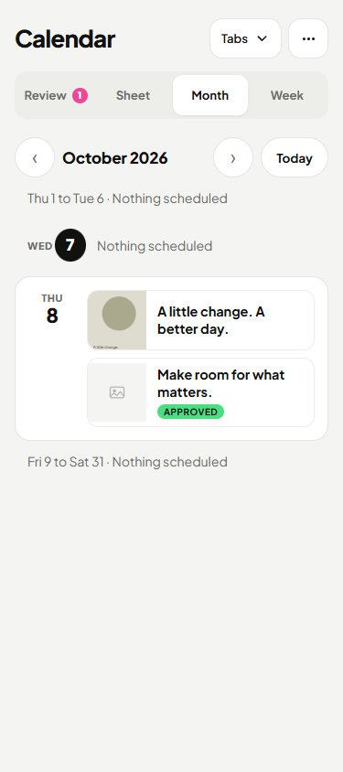
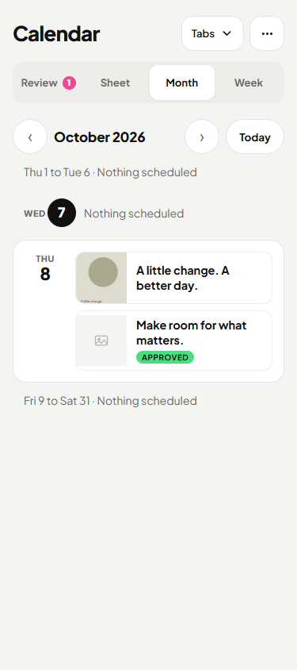
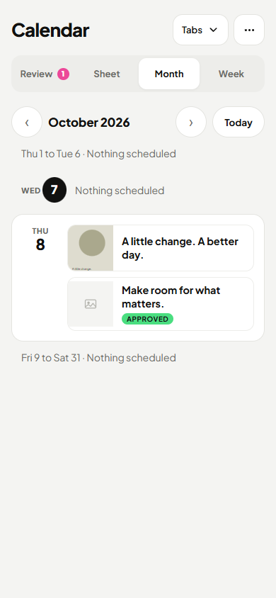
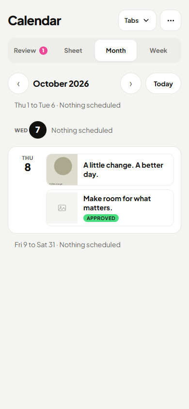
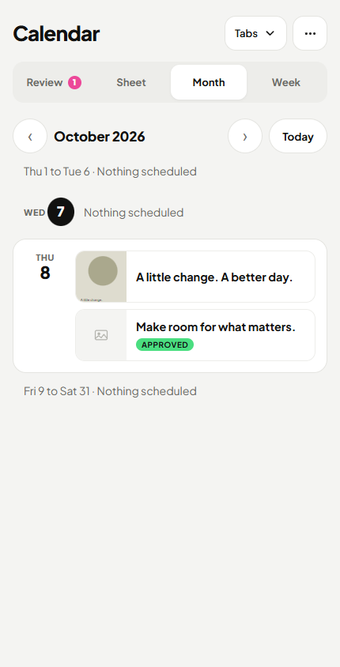
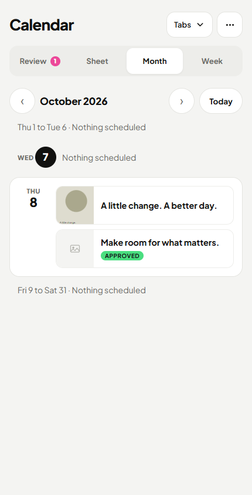
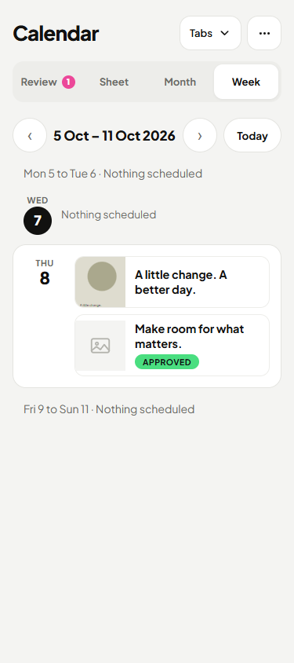
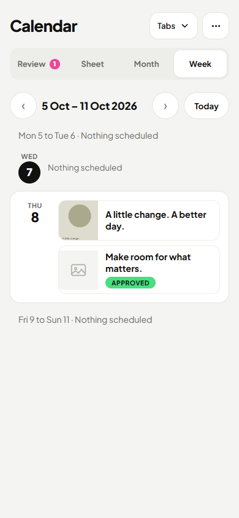
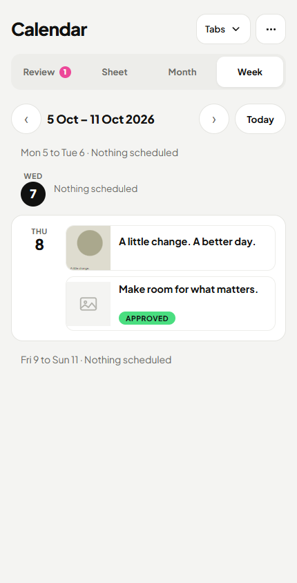

# Calendar CI follow-up gallery

All images are native fixture screenshots. Requested dark client preferences intentionally resolve to light. Before loading pictures retain the original failing build; empty Today pictures use the exact pre-follow-up build.

| State | Width | Requested theme | Before | After |
|---|---:|---|---|---|
| loading-month | 375 | light |  |  |
| loading-month | 375 | dark |  |  |
| loading-month | 390 | light |  |  |
| loading-month | 390 | dark |  |  |
| loading-month | 430 | light |  |  |
| loading-month | 430 | dark |  |  |
| loading | 375 | light |  |  |
| loading | 375 | dark |  |  |
| loading | 390 | light |  |  |
| loading | 390 | dark |  |  |
| loading | 430 | light |  |  |
| loading | 430 | dark |  |  |
| month-empty-today | 375 | light |  |  |
| month-empty-today | 375 | dark |  |  |
| month-empty-today | 390 | light |  |  |
| month-empty-today | 390 | dark |  |  |
| month-empty-today | 430 | light |  |  |
| month-empty-today | 430 | dark |  |  |
| week-empty-today | 375 | light |  |  |
| week-empty-today | 375 | dark |  |  |
| week-empty-today | 390 | light |  |  |
| week-empty-today | 390 | dark |  |  |
| week-empty-today | 430 | light |  |  |
| week-empty-today | 430 | dark |  |  |

360 px CI boundary:

| Requested theme | Before | After |
|---|---|---|
| light |  |  |
| dark |  |  |
