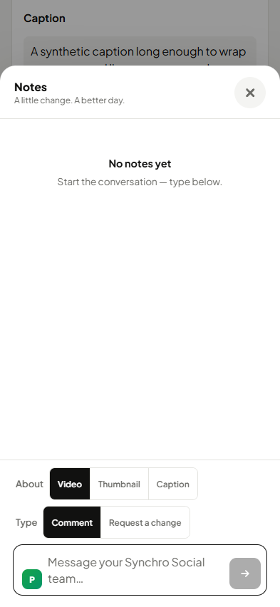
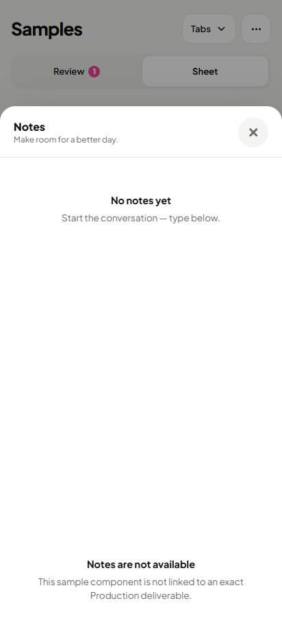

# Today and Notes before/after

18 personally reviewed native phone pairs, at 393 x 852 and 412 x 915. Staff uses light/dark; client pages use light. Each PNG is the complete viewport at native pixels. These cells do not certify the remaining coverage or a fresh-eyes round.

Source and PNG hashes: [screenshots](screenshots.json), [reviews](reviews.json), [source](source.json).

## today-all-clear · 393 · light

| Before | After |
|---|---|
|  |  |

## today-all-clear · 393 · dark

| Before | After |
|---|---|
|  |  |

## today-all-clear · 412 · light

| Before | After |
|---|---|
|  |  |

## today-all-clear · 412 · dark

| Before | After |
|---|---|
|  |  |

## calendar-card-notes · 393 · light

| Before | After |
|---|---|
|  |  |

## calendar-card-notes · 393 · dark

| Before | After |
|---|---|
|  |  |

## calendar-card-notes · 412 · light

| Before | After |
|---|---|
|  |  |

## calendar-card-notes · 412 · dark

| Before | After |
|---|---|
|  |  |

## samples-card-notes · 393 · light

| Before | After |
|---|---|
|  |  |

## samples-card-notes · 393 · dark

| Before | After |
|---|---|
|  |  |

## samples-card-notes · 412 · light

| Before | After |
|---|---|
|  |  |

## samples-card-notes · 412 · dark

| Before | After |
|---|---|
|  |  |

## notes · 393 · light

| Before | After |
|---|---|
|  |  |

## notes · 412 · light

| Before | After |
|---|---|
|  |  |

## samples-notes · 393 · light

| Before | After |
|---|---|
|  |  |

## samples-notes · 412 · light

| Before | After |
|---|---|
|  |  |

## samples-notes-unlinked · 393 · light

| Before | After |
|---|---|
|  |  |

## samples-notes-unlinked · 412 · light

| Before | After |
|---|---|
|  |  |
