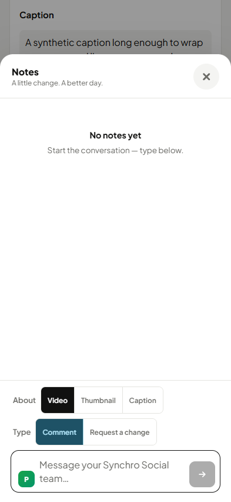
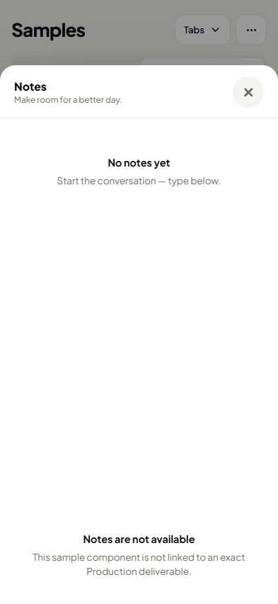
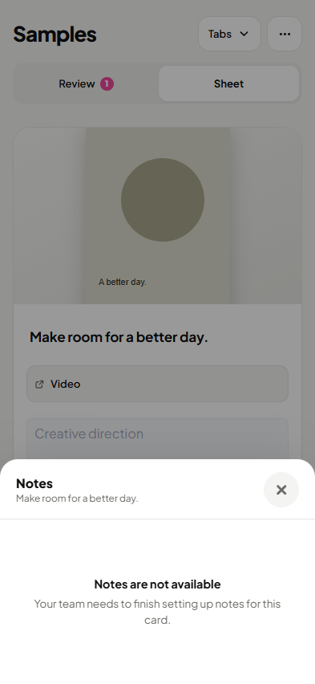
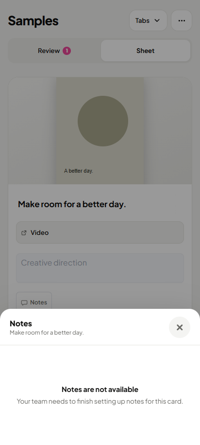

# Main integration: refreshed Today and Notes

18 current complete phone viewports, personally reviewed after main integration. Before pictures retain the original pre-batch fixtures; after pictures use the merged source. Source/PNG hashes and the current-main desktop comparison are recorded. This is a bounded batch review, not a full clean round or fresh-eyes acceptance.

## today-all-clear · 393 · light

| Original before | Current after |
|---|---|
|  |  |

## today-all-clear · 393 · dark

| Original before | Current after |
|---|---|
|  |  |

## today-all-clear · 412 · light

| Original before | Current after |
|---|---|
|  |  |

## today-all-clear · 412 · dark

| Original before | Current after |
|---|---|
|  |  |

## calendar-card-notes · 393 · light

| Original before | Current after |
|---|---|
|  |  |

## calendar-card-notes · 393 · dark

| Original before | Current after |
|---|---|
|  |  |

## calendar-card-notes · 412 · light

| Original before | Current after |
|---|---|
|  |  |

## calendar-card-notes · 412 · dark

| Original before | Current after |
|---|---|
|  |  |

## samples-card-notes · 393 · light

| Original before | Current after |
|---|---|
|  |  |

## samples-card-notes · 393 · dark

| Original before | Current after |
|---|---|
|  |  |

## samples-card-notes · 412 · light

| Original before | Current after |
|---|---|
|  |  |

## samples-card-notes · 412 · dark

| Original before | Current after |
|---|---|
|  |  |

## notes · 393 · light

| Original before | Current after |
|---|---|
|  |  |

## notes · 412 · light

| Original before | Current after |
|---|---|
|  |  |

## samples-notes · 393 · light

| Original before | Current after |
|---|---|
|  |  |

## samples-notes · 412 · light

| Original before | Current after |
|---|---|
|  |  |

## samples-notes-unlinked · 393 · light

| Original before | Current after |
|---|---|
|  |  |

## samples-notes-unlinked · 412 · light

| Original before | Current after |
|---|---|
|  |  |
