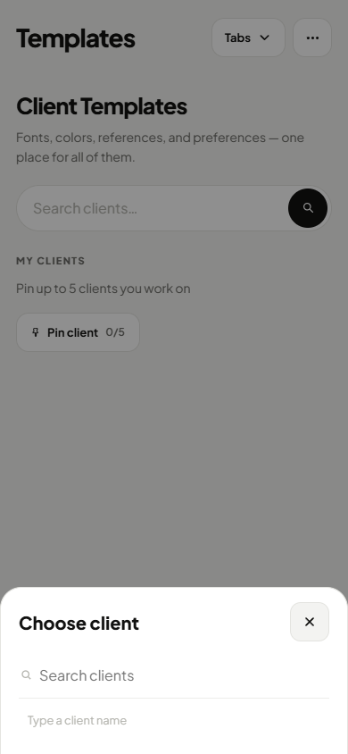
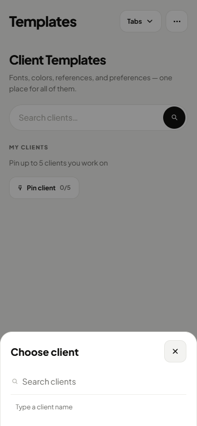
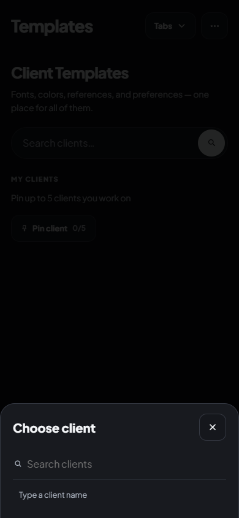
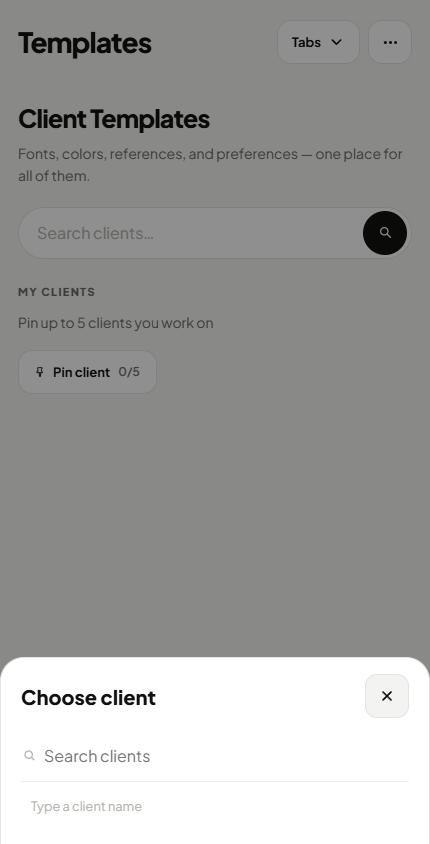
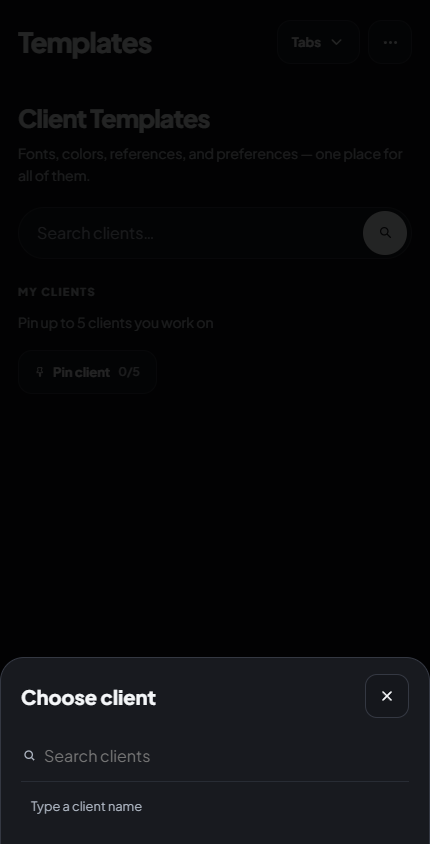
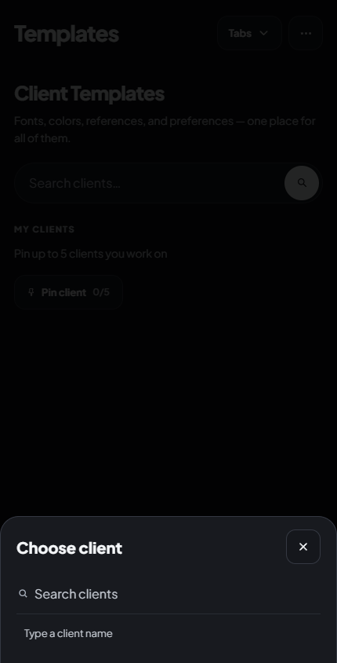

# CI follow-up: native hierarchy fixture and shared client sheet

The breadcrumb product markup was correct. Its raw hierarchy fixture now survives native adapter rebuilds; the strict assertion remains and applies at every width.

The shared Choose client sheet had a separate readability defect on the Templates route. The after captures apply the reviewed secondary text colour and 13 px helper / 16 px placeholder. All twelve native viewport images below were personally viewed. Full-page files were byte-identical duplicates.

These captures use fictional fixtures, intercepted transports and local font mirrors. The unfiltered CI-width runs use default asset loading without those overrides. Original full/fresh review manifests retain their original source binding.

| Width / theme | Before | Expanded draft | After |
| --- | --- | --- | --- |
| 390 / light |  |  |  |
| 390 / dark |  |  |  |
| 430 / light |  |  |  |
| 430 / dark |  |  |  |

Current source: `62570666b9a1d2f6a497af920521634bc3ba378a7f696244ba312069ae6edfe7`. [Structured receipts and hashes](ci-inventory-followup.json).

The incremental desktop comparison is against the prior PR head at 1440 × 900, complementing the original 182 main-to-batch desktop pairs.

```text
node qa/staff-phone-final-pass.js --all-states --widths=390
ok calendar-caption-prompt-normal 390 light
ok calendar-caption-prompt-normal 390 dark
ok calendar-caption-prompt-empty 390 light
ok calendar-caption-prompt-empty 390 dark
staff-phone-final-pass: 322 renders, 0 problems
```

```text
node qa/staff-phone-final-pass.js --all-states --widths=430
ok calendar-caption-prompt-normal 430 light
ok calendar-caption-prompt-normal 430 dark
ok calendar-caption-prompt-empty 430 light
ok calendar-caption-prompt-empty 430 dark
staff-phone-final-pass: 322 renders, 0 problems
```

```text
ok   staff-navProd @1440: pixels identical, computed styles identical (69a0a5875e6f)
ok   staff-navLinear @1440: pixels identical, computed styles identical (0d8c1e926923)
ok   staff-navKasper @1440: pixels identical, computed styles identical (79ffd59d68c2)
ok   staff-time-off @1440: pixels identical, computed styles identical (79e48f1e84df)

12/12 desktop shots identical to 4be1cdbdeceeb71baa381dd48e09ee03ffcfd1f2
```

Ledger entry 395 is unique in this branch and does not collide with PR #2030's entry 394, now on main. Main's eight historical duplicate numbers remain unchanged. Hosted CI and Lighthouse acceptance remain separate gates.
