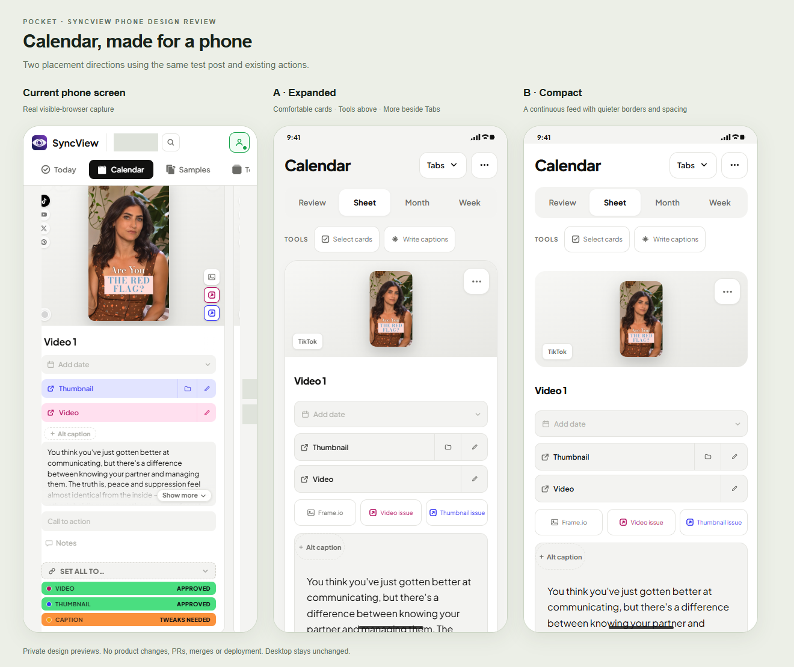
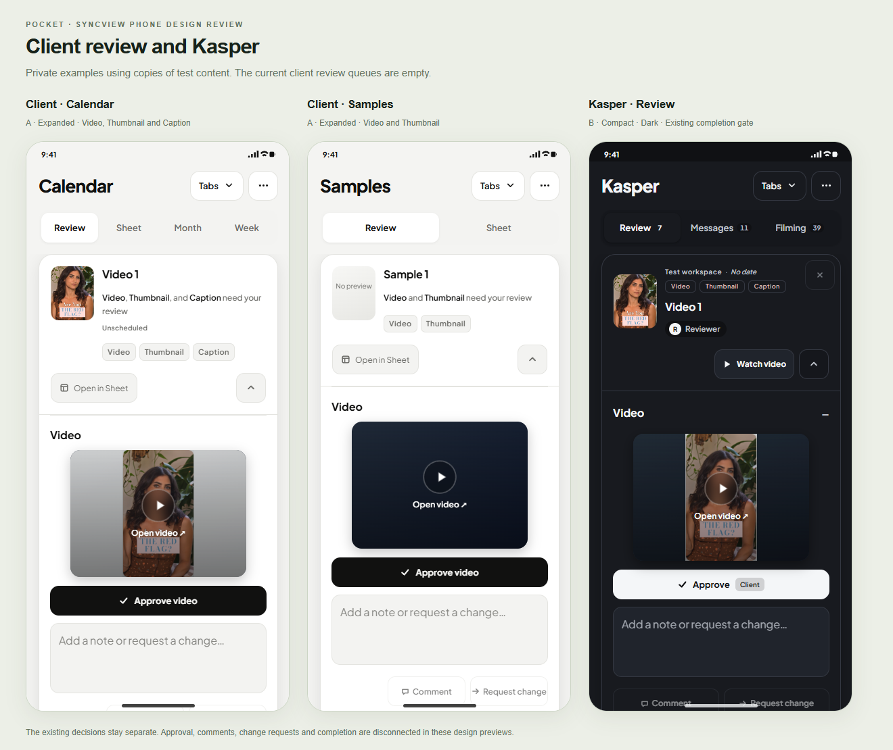

# Pocket phone experience — Claude review packet

**Status: draft design review, 2026-10-03. No product implementation or merge approval.**

SyncView needs a phone experience designed around the same actions and decision
flow as the desktop app. The owner wants clear, comfortable, one-hand use, with
Wise as the quality reference. Each tab may have its own phone layout. Desktop
must remain exactly as it is.

This PR includes the complete interactive gallery: 45 states, A/B layouts,
and light/dark appearance, plus its editable sources, comparison boards,
interaction checklist, design findings and recorded validation evidence. All
60 captured screen/menu structures are included with example private fields.
Account identifiers, contacts, credentials, real messages, sensitive HR data
and review tokens are excluded. The public export uses synthetic examples
where publication would expose private information; it preserves the design
and control structure. It is not a connection to the live app.

## Open the interactive gallery

For the complete handoff in one download, use
[pocket-phone-review.zip](pocket-phone-review.zip). Extract it and open
`gallery/gallery.html` in visible Chrome. The archive includes the interactive
gallery, editable sources, notes, boards and measurement evidence.

Download or check out this PR, then open
[gallery/gallery.html](gallery/gallery.html) in visible Chrome. This single file
contains the styles, font, images, screen data and interactions. It works
offline through a file URL; no server, build, sign-in or test review link is
required. GitHub's source view displays HTML text; download the file and open
it locally to use the gallery.

Choose a tab, a state and Light/Dark. Compare A and B, scroll inside each phone,
open Tabs and More, expand sections, type draft notes, try view switches, and
explore the platform-specific upload forms. Save, approve, send, link-opening
and upload actions display a preview notice or stay gated; they do not perform
business writes. The gallery is a layout/interaction prototype, not a full
implementation of the product's backend or accessibility behavior.

The [complete handoff](HANDOFF.md) explains every supplied artifact and the
remaining work. [gallery/](gallery/) contains the editable renderer, styles,
fixtures, shells, local assets and offline builder. Rebuild only this document
with `node docs/mockups/pocket-phone/gallery/build-gallery.cjs`. This does
not run the app build or modify generated app HTML. The local font license is
in [gallery/fonts/OFL.txt](gallery/fonts/OFL.txt).

## Compare the placements

- **A — Expanded:** comfortable cards and full sections, with regular actions
  close to the material they affect.
- **B — Compact:** quieter continuous lists and expandable sections. Review
  components or long forms can open one at a time while retaining their actions.

Both directions exist in light and dark appearance in the interactive gallery.
The boards show selected examples; the gallery contains every state. Approval
of a placement is still the owner's decision; no direction or first
implementation tab has been selected.

## Owner decisions already given

- Keep the same desktop actions, permissions, business rules and course of
  actions. A phone rearrangement must not invent features or change a workflow.
- Remove the separate SyncView/workspace header on phones.
- Put Tabs and More beside each other in the title row.
- Put infrequent Organize and minus/plus card sizing controls in More.
- Keep Calendar Tools above the content.
- Refine light and dark appearance; use calm, legible surfaces and stable status
  colors rather than saturated blocks throughout the page.
- Include both the client-facing review link and Kasper's tab, including its
  secondary sections.
- Pocket does not merge. Lighthouse handles merging after the required review
  and proof; this design PR is not authorization to merge or deploy.

## Preserve the existing workflow

| Surface | Actions and rules to preserve |
|---|---|
| Calendar | Review, Sheet, Month and Week; dates, captions, CTA, notes, separate component statuses, links, selection, alternate captions and their removal confirmation. Infrequent controls move to More, not out of the app. |
| Samples | Sheet and Review; video and thumbnail remain separate decisions. Missing or unreadable media must not look approved or silently disappear. |
| Templates and Filming Plans | Existing reference links, folders, documents and permitted edit actions. Preserve current empty states. |
| Upload | TikTok supports video and photo carousel. Instagram supports video with an optional image cover or frame from the video; its native form does not offer a carousel. Only the selected platform's form is visible. Keep account warnings, scheduling, options and the Post now gate. |
| Analytics | Existing views and filters. An empty source remains empty; do not invent charts or totals to decorate a mock-up. |
| Submit | The batch and all three existing choices: create video and graphic work, video issue only, or thumbnail issue only. Preserve saved copies. |
| Today and Workload | Existing counts, queues, capacity rules, filters and planner actions. Disclosure changes presentation, not workload placement or eligibility. |
| Linear | Preserve the visible label/route split: Linear is `navProd` / `production` / `#production`; Submit is `navLinear` / `linear` / `#linear`. Preserve authority gates, feedback, assets, sub-issues and deep links. |
| Client Calendar | Video, Thumbnail and Caption decisions stay separate. A note draft disables approval and enables comment/change choices. Staff status, archive, copy and alternate-caption controls stay unavailable. Collaborative mode retains caption, CTA and date editing and Suggest a post; existing card names stay locked. |
| Client Samples | Video and Thumbnail only; do not add a caption decision or staff actions. |
| Kasper | Existing component decisions and approve/route choices, notes, change requests, approval-after-tweaks behavior and completion gate. A still-pending component must not become finished because its section is collapsed. |

The live client review queues were empty during capture. The labelled review
examples are staged copies rendered through the existing review structures.
Their controls are disconnected from saves, approvals, messages and uploads.
One test review link was issued through the existing Share UI during the earlier
visible-browser session; no post status or message was changed.

## Interactive gallery coverage

These are the 45 reviewed states, each with A/B and light/dark versions:

| Tab or role | States |
|---|---|
| Calendar | Sheet, Review, Month, Week, Selection |
| Samples | Sheet, Review |
| Templates | Links and folders |
| Filming Plans | Document list |
| Upload | TikTok video, TikTok carousel, Instagram video, Instagram frame cover |
| Analytics | Analytics, Content Calendar, Brief |
| Submit | Saved batch |
| Today | Queue, Walk-through |
| Workload | Team overview and planner |
| Linear | Issues, Issue detail |
| Kasper | Review queue, Review example, Messages, Filming review, Editors, Time Off, Sales Intake, Hiring, Onboarding, Quiz Leads, Credentials, Clients, Save problems, Ad Performance |
| Client link | Calendar review example, current Calendar queue, Sheet, Month, Week, Analytics, Samples review example, current Samples queue, Samples Sheet |

The portable export is checked separately; see
[export-checks.txt](export-checks.txt). The original preview results are
historical evidence, not a product release-gate claim.

## Request to Claude

Review the design and handoff before implementation. Return concrete findings,
ranked by impact, with the affected screenshot, state or source control. Check:

1. Whether the phone placement still makes the desktop's next action familiar,
   including role-specific and Collaborative mode behavior.
2. Thumb reach, hierarchy, density, scrolling, dark contrast and whether A/B
   disclosure hides information needed for a decision.
3. Correct platform-specific upload controls and the client/Kasper review gates.
4. States still needing an owner decision or additional visual evidence,
   especially loading skeletons, saved copies, failed saves, recovery, keyboard
   focus and accessibility. The mock-up checks below do not prove these product
   behaviors end to end.
5. The desktop proof gap described below. Do not call the preview measurements
   product release gates, deployed evidence, or desktop parity proof.

Do not build additional tabs, merge, deploy, change authentication, send messages
or mutate any non-test client as part of this review.

## Evidence and limits

The original preview checks, before the portable export, are recorded in
[preview-checks.txt](preview-checks.txt), with safe raw measurement data in
[evidence/](evidence/). They passed 1,080 layout cases across
360/375/390/430 portrait widths and 667/740 landscape widths, 152 menu cases,
50 interaction checks, 90 lower-section cases and 180 gallery mounts. The
layout checks measured visible enabled controls, 16 px editable fields, clipped
labels and horizontal overflow. These are prototype measurements, not the
existing product phone gates, a complete accessibility audit or backend proof.

This PR changes documentation and standalone design-preview artifacts only. `src/index`, generated
`index.html`, `js`, app assets, routes and `OPEN_REPAIRS.md` must remain identical
to its base. Desktop source equality and final PR check results are recorded in
[pr-checks.txt](pr-checks.txt). The complete existing live client desktop parity
gate currently cannot run because the private staff credential is unavailable.
The existing staff Analytics smoke at 1024 px produced identical before/after
pixels but different computed styles, so that gate remains **FAIL** even though
the application files are byte-identical. Its cause has not been resolved here;
do not interpret source equality as a passing browser gate. Full desktop parity
remains **UNPROVEN** and keeps this PR a draft. No credential is requested in
this document or written into a file.

The truth check also remains red: it has the same 93 failing assertions on the
candidate and unchanged base, with zero added or removed failures. This PR does
not repair unrelated truth documentation or test infrastructure. The classified
unit runner failed 16 of 673 suites; all 16 failing suites were rerun on unchanged
main and failed there too. Required isolated/private-input profiles remain
NOT_RUN, not passing evidence.

## Implementation after the owner's go

The owner chooses placements and the first tab. Then implement one tab per PR,
in its own `src/index` fragments, rebuilding with `npm run build:index`; never
edit generated `index.html` by hand. Keep phone layout rules inside media
queries at widths no greater than 767 px. Preserve loading skeletons, saved
copies, recovery and all existing business logic.

Each implementation PR needs the existing phone gates, existing desktop gates,
before/after desktop screenshot diffs, a real visible-browser pass limited to
the designated test client, public-safe before/after images and a short note
covering changes, owner actions, actual token usage if available and the real
last lines of every check. Run the identity exposure check against `origin/main`
after committing. `OPEN_REPAIRS` remains append-only. Lighthouse merges;
Pocket never merges.
